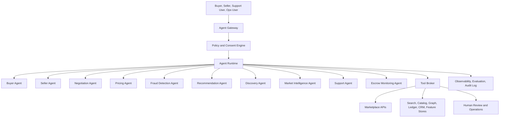

# AI Agent Ecosystem for Friction-Free Marketplace

## Executive summary

This document defines a complete AI agent ecosystem for a friction-free consumer marketplace. The ecosystem coordinates buyer assistance, seller automation, pricing, negotiation, discovery, recommendations, fraud prevention, market intelligence, support, and escrow monitoring as governed agents rather than isolated chatbots.

The design assumes the marketplace architecture described in [Technical Architecture](technical-architecture.md), the data model described in [Database Architecture](database-architecture.md), and the controls described in [Trust and Safety Framework](trust-and-safety-framework.md). The central operating principle is: **agents may accelerate marketplace decisions, but policy, permissions, auditability, user consent, and financial correctness define the boundaries of every action**.

## 1. Ecosystem operating model

### 1.1 Agent coordination pattern

The platform should run agents through a governed agent runtime with shared orchestration, tool permissions, memory controls, evaluation, and audit logging.

### 1.2 Shared governance rules

All agents follow these global rules:

1. **Least privilege**: Agents receive only the tools and records required for the current task.
2. **Human-confirmed commitment**: Agents may draft, recommend, summarize, and prepare transactions, but cannot commit irreversible user actions without explicit authorization unless the user has configured automation rules.
3. **Policy-before-tool execution**: Every sensitive tool call is checked against consent, risk, identity, regional rules, and transaction policy.
4. **Typed outputs**: Agents return structured outputs for downstream services, not free-form text alone.
5. **Auditable reasoning traces**: The platform records task objective, inputs, tool calls, policy checks, model version, prompts, summaries, decisions, and user confirmations.
6. **Memory minimization**: Agents store durable memories only when useful, consented, non-sensitive where possible, and compliant with retention rules.
7. **Separation of duties**: Agents that optimize conversion do not override agents responsible for fraud, escrow, compliance, or safety.
8. **Explainability**: User-facing agents explain recommendations in plain language; internal agents preserve reason codes and evidence bundles.
9. **Graceful escalation**: Agents escalate to humans when confidence is low, policy is ambiguous, users contest outcomes, or high-value transactions are at risk.
10. **Continuous evaluation**: Every agent is tested for task success, hallucination, policy adherence, tool misuse, bias, latency, cost, and business impact.

### 1.3 Common platform tools

The agent ecosystem shares a controlled tool broker that exposes:

- User, listing, order, offer, escrow, payment, shipment, message, review, and dispute APIs.
- Search, semantic retrieval, image search, catalog graph, knowledge graph, and geospatial matching.
- Pricing models, demand forecasts, market comparables, fee calculators, shipping calculators, tax estimators, and promotion engines.
- Fraud scores, identity verification status, device intelligence, graph risk, content moderation, sanctions and restricted-party checks, and case management.
- Messaging composer, notification sender, calendar scheduler, meetup planner, translation, summarization, and document generation.
- Human handoff tools for trust operations, customer support, payments operations, legal escalation, and account management.

### 1.4 Shared memory layers

Agents use four memory layers:

| Memory layer | Purpose | Examples | Retention posture |
| --- | --- | --- | --- |
| Session memory | Keep context during a single conversation or workflow. | Current budget, listing shortlist, proposed offer, unresolved support question. | Short lived; deleted or summarized after session. |
| User preference memory | Improve future experiences with consent. | Preferred brands, sizes, neighborhoods, delivery windows, negotiation style. | User-visible, editable, exportable, erasable. |
| Transaction memory | Preserve authoritative state for commerce. | Offer history, escrow terms, fulfillment milestones, inspection outcome. | Durable, auditable, policy-controlled. |
| Marketplace intelligence memory | Improve aggregate decisions. | Category trends, price distributions, fraud patterns, seller reliability cohorts. | Aggregated, privacy-preserving, regionally governed. |

## 2. Buyer agent

### Goals

- Translate buyer intent into safe, high-fit marketplace actions.
- Help buyers discover, compare, negotiate, purchase, and resolve issues with minimal friction.
- Protect buyers from scams, poor-fit items, hidden costs, unsafe meetups, and low-confidence sellers.
- Increase completed transactions, buyer satisfaction, repeat usage, and trust in the marketplace.

### Inputs

- Natural-language, image, voice, and structured search intent.
- Buyer profile, saved preferences, budget, location, delivery constraints, risk tolerance, and category interests.
- Search results, recommendations, listing metadata, seller reputation, pricing estimates, fulfillment options, and trust signals.
- Message threads, offer history, escrow state, disputes, returns, and support history.
- Policy decisions from fraud, content moderation, identity, payment, and escrow systems.

### Outputs

- Search refinements, ranked shortlists, comparison tables, and buying guides.
- Draft messages, questions for sellers, offer recommendations, negotiation boundaries, and purchase checklists.
- Transaction plans covering price, payment, escrow, delivery, pickup, inspection, and dispute options.
- Buyer-safe explanations of seller trust, listing risks, total cost, and likely fit.
- Confirmed tool actions when authorized: saved searches, watchlists, messages, offers, checkout starts, and support requests.

### Tools

- Marketplace search, semantic search, visual search, and recommendation APIs.
- Listing detail, seller profile, reputation, review, and transaction-history APIs.
- Pricing, shipping, tax, fee, escrow, and delivery estimate calculators.
- Messaging composer, translation, calendar, meetup safety, and notification tools.
- Fraud risk summary, listing authenticity summary, and policy-safe trust explanation tools.
- Offer creation, checkout initiation, payment authorization, and support-ticket creation tools gated by user confirmation.

### Memory

- Buyer preference profile: categories, brands, sizes, condition tolerance, budget bands, locations, delivery preferences, and communication style.
- Purchase intent memory: active searches, saved items, current shortlists, seller conversations, and offer strategy.
- Transaction memory: confirmed terms, escrow milestones, inspection notes, delivery commitments, and issue history.
- Safety memory: user-selected risk tolerance, blocked sellers, prior scam reports, and preferred protection levels.

### Workflows

1. **Intent capture**: Parse the buyer's request, infer category constraints, ask clarifying questions only when necessary, and create a structured search plan.
2. **Discovery and ranking**: Query search and recommendation systems, rank results by fit, trust, total cost, availability, fulfillment feasibility, and price fairness.
3. **Comparison**: Summarize tradeoffs across listings, including condition, seller reliability, estimated market value, delivery cost, returnability, and risk.
4. **Pre-purchase due diligence**: Generate seller questions, request missing evidence, check authenticity signals, and recommend escrow or inspection where appropriate.
5. **Offer strategy**: Consult the pricing and negotiation agents to recommend an offer range, maximum price, and communication approach.
6. **Checkout assistance**: Prepare payment, escrow, fulfillment, and inspection steps; require explicit user confirmation before committing funds.
7. **Post-purchase follow-through**: Track delivery or meetup, remind the buyer of inspection windows, collect feedback, and escalate issues.

### Permissions

- Can read buyer-authorized profile, preference, search, listing, message, and transaction data.
- Can create drafts, recommendations, saved searches, watchlists, and messages.
- Can send messages, place offers, start checkout, or open support cases only with explicit confirmation or preconfigured automation rules.
- Cannot bypass fraud controls, reveal private seller data, release escrow, alter ledger records, or make irreversible purchases without authorization.

## 3. Seller agent

### Goals

- Make listing creation, inventory management, buyer communication, negotiation, and fulfillment easier for sellers.
- Improve listing quality, pricing accuracy, response speed, sell-through, and seller reputation.
- Reduce policy violations, disputes, cancellations, stale inventory, and buyer dissatisfaction.

### Inputs

- Seller photos, videos, receipts, inventory files, voice notes, product identifiers, item condition, location, and availability.
- Seller profile, verification status, reputation, fulfillment capabilities, payout status, and category permissions.
- Market demand, comparable listings, pricing recommendations, promotion options, buyer questions, offers, and order events.
- Listing policy, prohibited item rules, authenticity requirements, category-specific compliance rules, and fraud risk signals.

### Outputs

- Structured listings with title, description, category, attributes, condition, media ordering, price, shipping, pickup, return, and warranty information.
- Listing quality improvements, missing-information prompts, authenticity evidence requests, and compliance warnings.
- Suggested responses to buyer questions, offer responses, bundle recommendations, promotion suggestions, and fulfillment instructions.
- Seller dashboards summarizing demand, conversion bottlenecks, price competitiveness, response metrics, and trust improvements.

### Tools

- Listing creation and editing APIs.
- Image understanding, OCR, product recognition, duplicate detection, content moderation, and catalog enrichment.
- Pricing agent, market intelligence agent, promotion engine, and listing quality scorer.
- Messaging, translation, notification, shipping label, pickup scheduling, payout status, and dispute APIs.
- Policy checker, restricted-goods classifier, authenticity verifier, and trust decision engine.

### Memory

- Seller operating profile: preferred listing templates, fulfillment windows, negotiation style, return policy, packaging capabilities, and payout preferences.
- Inventory memory: active listings, drafts, quantities, stale items, prior sales, defect patterns, and category performance.
- Buyer interaction memory: open questions, offers, commitments, promised accessories, appointment times, and support escalations.
- Compliance memory: seller-specific policy warnings, required verification steps, category restrictions, and appeal outcomes.

### Workflows

1. **Supply intake**: Convert photos, videos, receipts, or inventory files into structured listing drafts.
2. **Quality and policy review**: Check for prohibited items, missing attributes, duplicate listings, unsafe claims, counterfeit risk, and low-quality media.
3. **Pricing and promotion**: Ask the pricing agent for recommended list price, floor price, markdown schedule, and promotion strategy.
4. **Publishing**: Present the final listing for seller approval and publish through listing APIs after policy checks pass.
5. **Buyer response automation**: Summarize buyer questions, draft replies, detect risky messages, and route negotiation requests to the negotiation agent.
6. **Fulfillment coordination**: Prepare pickup, shipping, delivery, inspection, and escrow instructions after an accepted offer.
7. **Performance optimization**: Recommend price changes, media improvements, relisting, bundling, or delisting based on demand and conversion data.

### Permissions

- Can read seller-owned listings, inventory, messages, offers, order status, payout status, and performance analytics.
- Can draft listings, replies, price changes, fulfillment steps, and promotions.
- Can publish listings, update prices, accept offers, buy shipping labels, or initiate refunds only with seller confirmation or configured rules.
- Cannot hide required disclosures, manipulate reviews, bypass category compliance, access buyer private data, or accelerate payouts beyond escrow policy.

## 4. Negotiation agent

### Goals

- Help buyers and sellers reach fair, safe, and enforceable transaction terms.
- Reduce time-to-agreement, low-quality haggling, harassment, and misunderstandings.
- Preserve user control over price floors, maximum budgets, delivery commitments, and risk boundaries.
- Convert informal conversation into structured, auditable offers.

### Inputs

- Buyer goals, seller goals, budgets, floor prices, acceptable terms, urgency, and negotiation style.
- Listing details, market comparables, pricing recommendations, fee and delivery estimates, and seller inventory context.
- Message history, offer history, counteroffers, cancellations, disputed terms, and policy warnings.
- Fraud, safety, harassment, off-platform payment, and restricted-content signals.

### Outputs

- Offer ranges, counteroffer recommendations, concession strategies, and negotiation summaries.
- Draft messages calibrated for tone, fairness, urgency, and cultural context.
- Structured offer objects with price, quantity, delivery, pickup, escrow, inspection, return, and expiration terms.
- Agreement summaries suitable for checkout, escrow, fulfillment, and support teams.
- Escalation flags when negotiation becomes risky, abusive, deceptive, or ambiguous.

### Tools

- Pricing agent, fee calculator, delivery estimator, escrow terms engine, and promotion engine.
- Messaging composer, translation, sentiment and harassment classifiers, and off-platform payment detector.
- Offer creation, counteroffer, acceptance, expiration, and cancellation APIs.
- Policy engine, trust decision engine, and human escalation tools.

### Memory

- Session negotiation state: current offer, counteroffers, open concessions, unresolved terms, and proposed next message.
- User negotiation preferences: preferred tone, auto-counter rules, minimum acceptable price, maximum budget, and walk-away conditions.
- Transaction memory: final agreed terms, timestamps, confirmations, and evidence of commitments.
- Risk memory: prior blocked language, suspicious requests, repeated cancellations, and forced off-platform attempts.

### Workflows

1. **Boundary setup**: Collect or infer user constraints, then ask for explicit floor, ceiling, and non-price requirements when needed.
2. **Market context**: Request price guidance and comparable sales from the pricing and market intelligence agents.
3. **Strategy selection**: Choose an opening offer, counteroffer, concession schedule, or firm-price response.
4. **Message drafting**: Generate a concise, respectful, policy-compliant message and show the user before sending.
5. **Offer structuring**: Convert informal agreement into a structured offer with price, fulfillment, escrow, inspection, and expiration fields.
6. **Risk screening**: Detect pressure tactics, off-platform payment attempts, personal-data requests, or inconsistent terms.
7. **Agreement handoff**: Pass accepted terms to checkout, escrow monitoring, fulfillment, and support systems.

### Permissions

- Can read listing, offer, message, pricing, reputation, and transaction context relevant to the negotiation.
- Can draft and recommend messages, offers, and counteroffers.
- Can send negotiation messages or create offers only under explicit user authorization or automation rules.
- Cannot accept an offer, change escrow terms, disclose hidden reservation prices, or override trust and safety blocks without permission.

## 5. Pricing agent

### Goals

- Estimate fair market value, optimal list price, offer ranges, markdown schedules, and liquidity tradeoffs.
- Help sellers maximize expected net proceeds while helping buyers avoid overpayment.
- Support dynamic pricing while preserving transparency, fairness, and compliance.

### Inputs

- Listing attributes: category, brand, model, age, condition, location, media quality, accessories, authenticity evidence, and fulfillment options.
- Comparable active listings, sold listings, failed listings, returns, seasonality, local demand, and cross-market arbitrage signals.
- Seller goals such as sell-fast, maximize-price, clear-inventory, or hold-firm.
- Buyer budget, willingness-to-pay signals, saved searches, and urgency, when consented and policy permits.
- Fees, shipping costs, taxes, escrow costs, promotion costs, and platform incentives.

### Outputs

- Recommended list price, acceptable offer range, reserve or floor price suggestion, and markdown timeline.
- Buyer-side fair-price assessment, overpayment warnings, and best-offer guidance.
- Price confidence interval, comparable evidence, liquidity estimate, expected time to sell, and net-proceeds estimate.
- Promotion and bundling recommendations.
- Drift alerts when market conditions or listing performance make price changes advisable.

### Tools

- Historical sales index, active listing index, demand forecast models, category taxonomy, catalog graph, and condition normalization.
- Comparable selection engine, image quality scorer, shipping and fee calculators, tax estimator, and promotion simulator.
- Experimentation platform, feature store, and model monitoring dashboards.
- Seller agent, buyer agent, negotiation agent, and market intelligence agent interfaces.

### Memory

- Category price curves, local liquidity curves, and seasonal demand patterns.
- Listing-specific pricing history, price changes, impressions, favorites, questions, offers, and conversion outcomes.
- Seller pricing preference memory, such as discount tolerance and desired sell-through speed.
- Model performance memory, including calibration errors, drift metrics, and investigator or user feedback.

### Workflows

1. **Normalize listing**: Convert raw listing attributes into canonical product, condition, location, and fulfillment features.
2. **Select comparables**: Retrieve and rank relevant sold, active, and expired listings by similarity and recency.
3. **Estimate price**: Generate fair value, confidence interval, list price, offer range, and time-to-sell distribution.
4. **Explain recommendation**: Produce user-safe reasons such as condition, brand demand, local scarcity, accessories, and recent sales.
5. **Optimize objective**: Adjust recommendation for seller goals, buyer constraints, promotion budget, and marketplace liquidity.
6. **Monitor performance**: Trigger markdown, promotion, relisting, or bundle suggestions when impressions or offers underperform expected curves.

### Permissions

- Can read marketplace pricing, listing performance, comparable sales, and aggregated demand data.
- Can recommend list prices, offer ranges, markdowns, and promotions.
- Can update prices only through the seller agent with explicit seller permission or seller-defined automation rules.
- Cannot use protected buyer characteristics for discriminatory pricing, expose another seller's private data, or manipulate prices to mislead users.

## 6. Fraud detection agent

### Goals

- Detect, prevent, and contain fraud across accounts, listings, messages, payments, escrow, fulfillment, reviews, and support.
- Coordinate machine learning, rules, graph analysis, behavioral evidence, and human investigation.
- Reduce scam losses, counterfeit sales, stolen goods, account takeovers, mule activity, refund abuse, and off-platform payment risk.

### Inputs

- Account, device, IP, identity, payment, payout, listing, message, offer, escrow, shipment, dispute, chargeback, and review events.
- Fraud graph edges among users, devices, addresses, payment methods, listings, messages, counterparties, and external intelligence.
- Content moderation signals, image forensics, receipt verification, category risk, velocity metrics, and reputation history.
- Human investigator labels, law-enforcement requests, chargeback outcomes, user reports, and model drift alerts.

### Outputs

- Risk scores, reason codes, evidence bundles, and recommended controls.
- Decisions such as allow, warn, rate-limit, require verification, require escrow, hold payout, block listing, suspend account, or send to review.
- Case summaries and investigation queues for human trust operations.
- Fraud pattern alerts and rule/model improvement proposals.

### Tools

- Trust decision engine, feature store, fraud graph, device intelligence, identity vault, sanctions and watchlist screening, and payment risk APIs.
- Content moderation, image similarity, OCR verification, link analysis, message safety, and anomaly detection models.
- Case management, investigator labeling, user report triage, appeal handling, and audit export tools.
- Payout hold, escrow hold, listing suppression, account limitation, and verification challenge tools.

### Memory

- Fraud pattern memory: known scam scripts, mule clusters, risky device fingerprints, counterfeit patterns, and category-specific schemes.
- Entity risk memory: account trust levels, prior interventions, appeals, verified corrections, and investigator outcomes.
- Transaction risk memory: high-risk offers, suspicious term changes, fulfillment anomalies, and payout holds.
- Model governance memory: model versions, thresholds, false-positive rates, drift metrics, and rule histories.

### Workflows

1. **Realtime action scoring**: Score sensitive actions before they commit, including listing publication, message send, offer acceptance, payment, and payout.
2. **Evidence aggregation**: Pull graph, behavior, device, identity, content, payment, and reputation features into a single decision context.
3. **Control selection**: Choose the least intrusive action that reduces risk below policy threshold.
4. **Case creation**: Create an investigator-ready evidence bundle for high-risk or ambiguous cases.
5. **Feedback loop**: Ingest labels from chargebacks, disputes, user reports, support outcomes, and investigator decisions.
6. **Adversary response**: Detect emerging fraud clusters, simulate rule impact, deploy controlled mitigations, and monitor false positives.

### Permissions

- Can read risk-relevant platform data under strict purpose limitation and audit controls.
- Can recommend or apply risk controls according to policy, including temporary holds, step-up verification, and listing suppression.
- Can access sensitive identity or payment features only through tokenized, role-gated tools.
- Cannot reveal internal fraud logic to users, make unsupported punitive decisions, or permanently seize funds without human/legal/payment policy approval.

## 7. Recommendation agent

### Goals

- Deliver personalized, trustworthy, and diverse recommendations that match user intent and marketplace health goals.
- Balance relevance, price fairness, safety, seller quality, fulfillment feasibility, freshness, diversity, and exploration.
- Increase conversion and retention without creating filter bubbles, discriminatory outcomes, or unsafe amplification.

### Inputs

- User preferences, browsing behavior, saved searches, favorites, purchases, location, budget, category interests, and explicit feedback.
- Listing embeddings, attributes, availability, seller reputation, price fairness, fulfillment options, and risk status.
- Marketplace supply-demand signals, promotions, local liquidity, seasonality, and inventory freshness.
- Policy constraints, blocked users, content safety, restricted categories, and ranking fairness rules.

### Outputs

- Ranked listing recommendations, seller recommendations, bundles, substitute items, complementary services, and saved-search alerts.
- Explanation tags such as “matches your size,” “good local price,” “seller responds quickly,” or “available for delivery this weekend.”
- Exploration candidates that expand user options without sacrificing safety or relevance.
- Feedback events for ranking improvement and experimentation.

### Tools

- Candidate generation, embedding search, collaborative filtering, graph recommendations, and learning-to-rank models.
- Search index, catalog graph, user preference store, feature store, experimentation platform, and notification tools.
- Pricing fairness signal, fraud risk filters, listing quality filters, and fulfillment feasibility tools.
- Buyer agent, discovery agent, and market intelligence agent interfaces.

### Memory

- User preference memory with explicit and inferred interests, negative feedback, blocked categories, preferred locations, and price ranges.
- Session context for current browse journey, query refinements, and shortlist comparisons.
- Aggregate recommendation memory such as category affinity, co-purchase patterns, local trends, and cold-start priors.
- Evaluation memory covering click-through, conversion, complaint rate, diversity, fairness, and long-term satisfaction metrics.

### Workflows

1. **Context assembly**: Combine explicit user intent, session behavior, long-term preferences, location, availability, and safety constraints.
2. **Candidate generation**: Retrieve candidates from semantic search, collaborative filtering, graph expansion, seller inventory, and local trend pools.
3. **Filtering**: Remove unavailable, unsafe, blocked, duplicate, restricted, stale, or poor-quality candidates.
4. **Ranking**: Score by intent fit, value, trust, fulfillment feasibility, freshness, seller quality, and marketplace objectives.
5. **Diversification**: Ensure category, price, seller, geography, and condition diversity where appropriate.
6. **Explanation and delivery**: Return ranked items with concise reasons and feedback hooks.
7. **Learning**: Feed clicks, saves, purchases, hides, disputes, and satisfaction outcomes back into models.

### Permissions

- Can read consented user preference and behavior data, listing data, seller quality signals, and aggregate market signals.
- Can generate recommendations, alerts, and explanation tags.
- Can send proactive notifications only under user notification preferences and frequency caps.
- Cannot rank unsafe listings, use protected attributes for discriminatory targeting, or disclose private reasons from fraud systems.

## 8. Discovery agent

### Goals

- Convert broad, ambiguous, multimodal, or exploratory intent into useful marketplace navigation.
- Help users discover categories, local opportunities, comparable products, and safe transaction paths.
- Improve marketplace liquidity by connecting latent demand with available or upcoming supply.

### Inputs

- Natural-language questions, images, screenshots, voice notes, location, lifestyle constraints, and event-driven needs.
- Marketplace taxonomy, catalog graph, listing embeddings, local inventory, category guides, and knowledge base content.
- User preferences, saved searches, budget, delivery constraints, and buyer or seller context.
- Trending searches, local demand, market gaps, and recommendation candidates.

### Outputs

- Clarified intent, suggested categories, search facets, query expansions, and guided browsing paths.
- Visual or semantic matches, substitutes, complementary items, and educational category summaries.
- Saved-search setup, demand alerts, and “notify me when available” requests.
- Handoff context for buyer, seller, recommendation, and market intelligence agents.

### Tools

- Semantic search, visual search, taxonomy classifier, catalog graph, listing search, and knowledge retrieval.
- Geospatial matching, saved-search APIs, demand forecast tools, and notification tools.
- Recommendation agent and buyer agent interfaces.
- Translation, accessibility, and multimodal understanding tools.

### Memory

- Session exploration memory: current goal, interpreted concepts, rejected options, selected facets, and open questions.
- User discovery preference memory: preferred browsing style, recurring projects, local areas, brands, and category affinities.
- Taxonomy memory: synonym maps, local naming variations, category relationships, and item compatibility graphs.
- Demand memory: unmet searches, waitlists, emerging interests, and no-result patterns.

### Workflows

1. **Intent interpretation**: Translate vague requests, images, or voice into structured concepts and possible categories.
2. **Clarification**: Ask targeted questions only when ambiguity materially affects results.
3. **Exploration path generation**: Build a guided path across categories, filters, educational content, and relevant listings.
4. **Candidate retrieval**: Query search, visual search, recommendations, and graph neighbors.
5. **Substitution and expansion**: Suggest alternatives, compatible items, bundles, services, or nearby locations.
6. **Demand capture**: When supply is weak, create saved searches, alerts, or seller-sourcing signals.
7. **Handoff**: Pass clarified intent and candidates to the buyer agent or recommendation agent.

### Permissions

- Can read public listing data, taxonomy, catalog graph, aggregate demand signals, and consented user preferences.
- Can create saved searches and alerts with user confirmation.
- Can recommend categories, filters, and exploratory paths.
- Cannot expose private inventory, infer sensitive traits unnecessarily, or send unsolicited alerts outside user preferences.

## 9. Market intelligence agent

### Goals

- Give internal teams, sellers, and approved partners actionable intelligence about supply, demand, pricing, liquidity, competition, fraud trends, and regional performance.
- Detect market gaps, category opportunities, pricing anomalies, emerging scams, and operational bottlenecks.
- Support strategic planning without exposing private user data or enabling anticompetitive misuse.

### Inputs

- Aggregated listing, search, recommendation, sales, pricing, fulfillment, dispute, fraud, and support data.
- Regional, category, seasonal, macroeconomic, logistics, and external public-market signals where permitted.
- Experiment results, promotion performance, seller cohort performance, buyer demand gaps, and local liquidity metrics.
- Policy constraints, privacy thresholds, data-sharing agreements, and role-based access rules.

### Outputs

- Dashboards, alerts, forecasts, market briefs, category scorecards, and opportunity reports.
- Price trend summaries, demand heatmaps, supply gaps, seller performance benchmarks, and inventory recommendations.
- Fraud trend reports, abuse pattern summaries, and risk-control impact analysis for trust operations.
- Structured insights for pricing, recommendation, discovery, seller, and operations agents.

### Tools

- Analytics warehouse, streaming analytics, BI dashboards, forecasting models, anomaly detection, and geospatial analytics.
- Pricing model outputs, recommendation metrics, search analytics, support analytics, fraud graph summaries, and experimentation platform.
- Privacy aggregation, k-anonymity thresholding, differential privacy mechanisms where appropriate, and data export governance.
- Internal notification, report generation, and workflow task creation tools.

### Memory

- Market baseline memory: historical category performance, regional liquidity, price trends, fulfillment reliability, and conversion funnels.
- Forecast memory: demand projections, confidence intervals, seasonality, and model drift indicators.
- Insight memory: prior reports, decisions made, experiments launched, and observed outcomes.
- Governance memory: data access approvals, aggregation thresholds, report recipients, and retention policies.

### Workflows

1. **Signal collection**: Gather aggregated marketplace, trust, pricing, search, recommendation, support, and fulfillment metrics.
2. **Anomaly and opportunity detection**: Identify supply shortages, demand spikes, pricing dislocations, fraud spikes, and operational degradation.
3. **Forecasting**: Produce category, region, inventory, and price forecasts with confidence estimates.
4. **Insight generation**: Convert analysis into clear recommendations for product, operations, sellers, and other agents.
5. **Governance review**: Apply privacy thresholds, role restrictions, and external-sharing rules before delivery.
6. **Action routing**: Create tasks for seller acquisition, pricing updates, fraud controls, campaigns, or support staffing.
7. **Outcome tracking**: Measure whether recommended actions improved liquidity, conversion, safety, or satisfaction.

### Permissions

- Can read aggregated and role-authorized marketplace analytics.
- Can generate internal reports, seller-facing benchmarks, alerts, and task recommendations.
- Can share data externally only through approved, aggregated, privacy-reviewed channels.
- Cannot expose individual buyer behavior, private seller strategy, personal data, or competitively sensitive details without explicit authorization and legal review.

## 10. Support agent

### Goals

- Resolve customer issues quickly, accurately, and empathetically across buying, selling, payments, escrow, fulfillment, trust, disputes, and account access.
- Reduce support workload while improving consistency, policy adherence, and escalation quality.
- Preserve user trust during high-stress incidents such as suspected fraud, lost shipments, account compromise, or escrow disputes.

### Inputs

- User messages, conversation history, account status, listings, orders, offers, escrow state, shipment state, payment events, dispute records, and support history.
- Knowledge base articles, policy documents, refund rules, escrow rules, seller standards, buyer protection terms, and troubleshooting guides.
- Fraud risk summaries, identity verification status, moderation decisions, appeal status, and human case notes.
- User sentiment, language, accessibility needs, and urgency signals.

### Outputs

- Answers, troubleshooting steps, policy explanations, status summaries, and next-best actions.
- Support tickets, case summaries, escalation packages, refund or dispute recommendations, and evidence requests.
- Draft replies for human agents and structured updates to CRM or case management systems.
- User-safe explanations of decisions and expected timelines.

### Tools

- CRM, case management, knowledge base retrieval, order lookup, escrow status, payment status, shipment tracking, and dispute APIs.
- Identity verification, account recovery, fraud summary, moderation appeal, and human escalation tools.
- Refund calculator, policy engine, translation, sentiment detection, summarization, and notification tools.
- Buyer, seller, fraud detection, and escrow monitoring agent interfaces.

### Memory

- Session support memory: issue type, facts gathered, user sentiment, attempted fixes, promised follow-ups, and escalation state.
- Case memory: ticket history, evidence, agent notes, policy decisions, dispute milestones, and resolution outcomes.
- User service memory: communication preferences, accessibility accommodations, repeated issues, and prior satisfaction signals.
- Knowledge memory: policy versions used, article effectiveness, macros, and unresolved knowledge gaps.

### Workflows

1. **Issue triage**: Classify the issue, urgency, user role, transaction impact, and safety risk.
2. **Context retrieval**: Pull relevant orders, escrow events, messages, policies, and prior tickets.
3. **Resolution attempt**: Provide answer, guided troubleshooting, evidence request, or next action within permission limits.
4. **Sensitive action gating**: Route refunds, account recovery, fraud cases, and escrow changes through policy and human approval when required.
5. **Escalation**: Create a concise evidence-backed handoff for support, trust, payments, legal, or operations teams.
6. **Follow-up**: Notify users of status changes, expected timelines, and required actions.
7. **Learning loop**: Feed unresolved questions, policy confusion, and satisfaction outcomes into knowledge base and product improvements.

### Permissions

- Can read support-relevant account, order, message, payment, escrow, shipment, dispute, and policy records.
- Can answer questions, create tickets, request evidence, update case notes, and send approved notifications.
- Can recommend refunds, holds, appeals, and escalations, but executes sensitive financial or account actions only when policy permits.
- Cannot reveal private counterparty data, override fraud decisions, make legal admissions, or release escrow funds without required approval.

## 11. Escrow monitoring agent

### Goals

- Protect buyers, sellers, and the platform by monitoring escrow lifecycle events from authorization through release, refund, dispute, or payout.
- Detect stalled, inconsistent, risky, or policy-violating escrow states before they become financial losses or trust incidents.
- Ensure ledger correctness, milestone compliance, auditability, and timely user communication.

### Inputs

- Offer terms, payment authorization, escrow creation, ledger entries, fulfillment milestones, shipment tracking, delivery proof, inspection windows, refund requests, disputes, and payout schedules.
- Buyer and seller confirmations, messages about condition or fulfillment, support tickets, fraud risk scores, chargeback alerts, and payment partner events.
- Regional escrow rules, category-specific inspection requirements, fee schedules, tax handling, payout policies, and dispute policies.

### Outputs

- Escrow status summaries, milestone reminders, anomaly alerts, hold recommendations, release recommendations, refund recommendations, and dispute triggers.
- Evidence bundles for payment operations, support, trust operations, and dispute reviewers.
- User notifications explaining required actions, deadlines, missing confirmations, or pending reviews.
- Reconciliation exceptions for ledger and finance operations.

### Tools

- Escrow service, ledger service, payment processor APIs, payout service, refund service, dispute system, and reconciliation tools.
- Shipment tracking, delivery proof verification, inspection workflow, messaging summarizer, and notification tools.
- Fraud detection agent, support agent, policy engine, and human payments-operations escalation tools.
- Audit log, idempotency checker, and financial reporting tools.

### Memory

- Transaction escrow memory: terms, milestone timestamps, confirmations, evidence, holds, disputes, refunds, releases, and payout history.
- Policy memory: regional escrow requirements, category inspection windows, release conditions, and exception rules.
- Risk memory: payment anomalies, chargeback signals, suspicious term changes, repeated dispute patterns, and payout risk.
- Reconciliation memory: ledger balances, processor events, settlement files, exceptions, and correction records.

### Workflows

1. **Escrow initialization**: Validate offer terms, buyer authorization, seller eligibility, fees, taxes, and escrow policy before escrow creation.
2. **Milestone monitoring**: Track shipment, delivery, meetup confirmation, inspection window, cancellation window, dispute window, and payout timing.
3. **Anomaly detection**: Flag missing events, duplicate processor callbacks, ledger mismatches, suspicious messages, chargeback signals, or conflicting confirmations.
4. **User communication**: Remind users of deadlines, evidence requirements, inspection steps, and next milestones.
5. **Release or hold recommendation**: Recommend escrow release, partial release, refund, hold, or dispute based on policy and evidence.
6. **Human escalation**: Route high-value, ambiguous, contested, legally sensitive, or ledger-inconsistent cases to payments operations.
7. **Reconciliation and audit**: Match escrow ledger entries to payment partner events and preserve evidence for audits, disputes, and financial reporting.

### Permissions

- Can read escrow, ledger, payment, payout, refund, shipment, dispute, support, and fraud-risk records needed for the transaction.
- Can send reminders, create operations alerts, generate evidence bundles, and recommend release, hold, refund, or dispute actions.
- Can place temporary holds only under explicit escrow policy and audit logging.
- Cannot unilaterally release funds, modify ledger balances, issue refunds, or reverse payouts without policy authorization and required human or system approvals.

## 12. Cross-agent collaboration

| Scenario | Primary agent | Collaborators | Outcome |
| --- | --- | --- | --- |
| Buyer wants a used laptop under budget | Buyer agent | Discovery, Recommendation, Pricing, Fraud Detection | Safe shortlist with fair-price guidance and seller-risk context. |
| Seller uploads item photos | Seller agent | Pricing, Fraud Detection, Market Intelligence | Policy-compliant listing draft with recommended price and publication readiness. |
| Buyer and seller haggle | Negotiation agent | Buyer, Seller, Pricing, Fraud Detection | Structured offer with bounded concessions and safety checks. |
| Suspicious high-value listing appears | Fraud Detection agent | Seller, Pricing, Market Intelligence, Support | Listing hold, evidence request, case creation, or safe publication. |
| Escrow delivery is disputed | Escrow Monitoring agent | Support, Fraud Detection, Buyer, Seller | Evidence bundle, user updates, hold or resolution recommendation. |
| Category demand spikes in a city | Market Intelligence agent | Discovery, Recommendation, Seller, Pricing | Seller-sourcing tasks, pricing updates, and targeted discovery experiences. |

## 13. Implementation roadmap

### Phase 1: Governed foundations

- Build the agent gateway, tool broker, policy checks, audit logging, and human handoff.
- Launch buyer, seller, support, pricing, and fraud detection agents with limited tool permissions.
- Require human confirmation for all messages, offers, listings, payments, refunds, and escrow actions.

### Phase 2: Transaction automation

- Add negotiation and escrow monitoring agents.
- Convert accepted natural-language agreements into structured offers and escrow terms.
- Introduce seller-configured automation rules for low-risk price changes, saved replies, and offer counters.

### Phase 3: Intelligence and personalization

- Launch recommendation, discovery, and market intelligence agents.
- Add preference memory, semantic search, visual search, demand alerts, and local-market insights.
- Begin controlled proactive recommendations and seller performance coaching.

### Phase 4: Closed-loop optimization

- Connect agent outcomes to experimentation, model monitoring, cost controls, and policy evaluation.
- Automate low-risk support and escrow workflows under strict thresholds.
- Expand privacy-preserving market intelligence for sellers and approved partners.

## 14. Success metrics

| Agent | Primary metrics |
| --- | --- |
| Buyer agent | Search-to-purchase conversion, buyer satisfaction, time to shortlist, protected checkout rate, dispute rate. |
| Seller agent | Listing completion rate, listing quality score, sell-through, response time, seller satisfaction, policy violation rate. |
| Negotiation agent | Offer acceptance rate, time to agreement, cancellation rate, abusive-message rate, term ambiguity rate. |
| Pricing agent | Price calibration error, time to sell, net proceeds, buyer fair-price satisfaction, markdown effectiveness. |
| Fraud detection agent | Fraud loss rate, false-positive rate, precision and recall, time to intervention, appeal overturn rate. |
| Recommendation agent | Conversion, long-term satisfaction, diversity, complaint rate, unsafe recommendation rate, repeat engagement. |
| Discovery agent | No-result recovery rate, saved-search conversion, intent clarification success, exploratory conversion. |
| Market intelligence agent | Forecast accuracy, opportunity adoption, liquidity improvement, report usage, privacy compliance. |
| Support agent | First-contact resolution, escalation quality, handle time, CSAT, policy accuracy, repeat contact rate. |
| Escrow monitoring agent | On-time release rate, ledger exception rate, dispute prevention, payout hold accuracy, reconciliation timeliness. |
