# Database Architecture

## Executive summary

This document defines the complete database architecture for the AI-powered marketplace platform. It covers the transactional schema, domain data ownership, ER diagrams, indexes, partitioning, sharding, and operational scaling approach for user accounts, commerce identity, reputation, listings, transactions, escrow, offers, messaging, fraud intelligence, AI recommendations, notifications, saved intents, buyer agents, seller agents, analytics, and audit logs.

The design uses a polyglot persistence model with PostgreSQL-compatible relational stores for most domain OLTP data, a distributed SQL ledger store for financial correctness, Kafka-compatible events for durable change propagation, OpenSearch or equivalent search infrastructure for listings and moderation search, Redis or Valkey for hot caches and rate limits, object storage for media and compliance artifacts, a warehouse or lakehouse for analytics, and a vector database or PostgreSQL vector extension for semantic retrieval.

## Architecture goals

1. **Financial correctness**: Transactions, escrow, ledger entries, refunds, chargebacks, and payouts must be strongly consistent, idempotent, and reconcilable.
2. **Trust and safety at the core**: Identity, reputation, fraud signals, device data, reviews, disputes, and audit logs must be queryable together without coupling every service to one database.
3. **Regional autonomy**: Regional cells own most local marketplace traffic while global control planes own account, policy, risk, and analytics projections.
4. **Event-driven projections**: Search, recommendations, notifications, fraud features, reputation aggregates, and analytics are projections from immutable domain events.
5. **Privacy by design**: PII is isolated, encrypted, tokenized where possible, retention-bound, and replicated only where product and compliance requirements allow.
6. **Operationally scalable schemas**: High-write tables use time or hash partitioning, tenant or region-aware keys, and outbox-based event publication.

## Database service boundaries

| Service boundary | Primary datastore | Consistency requirement | Primary data |
| --- | --- | --- | --- |
| User profile | Regional PostgreSQL plus global account directory | Strong per user, eventual global projection | Accounts, profiles, sessions, credentials, preferences |
| Commerce identity | Regional PostgreSQL with encrypted PII vault | Strong for verification state | KYC/KYB, addresses, tax profiles, payment identities |
| Reputation | Regional PostgreSQL plus streaming aggregates | Strong for reviews, eventual for scores | Reviews, trust signals, reputation dimensions |
| Listings | Regional PostgreSQL plus search index | Strong authoring, eventual search | Listings, variants, media, attributes, availability |
| Transactions | Distributed SQL or serializable PostgreSQL per region | Strong | Orders, line items, state machines, disputes |
| Escrow and ledger | Distributed SQL ledger database | Strongest consistency | Escrow accounts, holds, releases, ledger entries |
| Offers | Regional PostgreSQL | Strong per listing-offer negotiation | Offers, counteroffers, expirations |
| Messaging | Wide-column or sharded PostgreSQL plus object storage | Ordered per conversation | Conversations, messages, attachments, moderation state |
| Fraud intelligence | Feature store, graph store, PostgreSQL case system | Mixed | Risk events, device graph, cases, model scores |
| AI recommendations | Feature store, vector store, lakehouse | Eventual | Embeddings, candidates, model outputs, feedback |
| Notifications | Regional PostgreSQL plus queue | At-least-once delivery | Notification preferences, deliveries, provider receipts |
| Saved intents | Regional PostgreSQL plus vector/search projection | Strong for intent saves, eventual matching | Buyer intents, alerts, semantic constraints |
| Buyer agents | Regional PostgreSQL plus workflow state | Strong for permissions and actions | Agent goals, budgets, policies, executions |
| Seller agents | Regional PostgreSQL plus workflow state | Strong for permissions and actions | Pricing, listing automation, negotiation policy |
| Analytics | Lakehouse and warehouse | Eventual | Facts, dimensions, attribution, experiments |
| Audit logs | Append-only object storage plus indexed metadata | Immutable append | Admin actions, policy decisions, data access logs |

## Identifier strategy

All externally visible IDs use sortable, opaque identifiers such as UUIDv7 or ULID. Internal records include `region_id`, `cell_id`, and `created_at` for routing and partition pruning. High-volume tables also include a shard key such as `user_id`, `listing_id`, `conversation_id`, or `transaction_id`.

| Entity type | Example prefix | Routing key |
| --- | --- | --- |
| User | `usr_` | `home_region_id`, `user_id` |
| Listing | `lst_` | `region_id`, `listing_id` |
| Offer | `off_` | `listing_id`, `buyer_id` |
| Transaction | `txn_` | `region_id`, `transaction_id` |
| Escrow account | `esc_` | `transaction_id` |
| Conversation | `cnv_` | `conversation_id` |
| Message | `msg_` | `conversation_id`, `created_at` |
| Fraud event | `frd_` | `subject_id`, `created_at` |
| Agent | `agt_` | `owner_user_id`, `agent_id` |

## Global ER overview

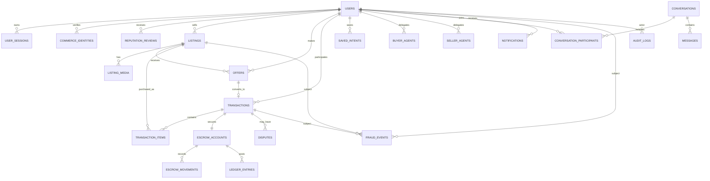

## 1. User system

### Purpose

The user system owns account identity, authentication, authorization, sessions, public profiles, user settings, privacy consent, and account lifecycle state. PII-heavy records are separated from public profile data to minimize replication and query exposure.

### ER diagram

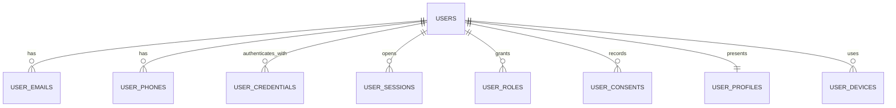

### Tables

| Table | Key columns | Notes |
| --- | --- | --- |
| `users` | `user_id` PK, `home_region_id`, `status`, `account_type`, `created_at`, `deleted_at` | Canonical account record. |
| `user_profiles` | `user_id` PK/FK, `display_name`, `avatar_media_id`, `bio`, `locale`, `timezone`, `public_location_geohash` | Public and marketplace-facing profile. |
| `user_emails` | `email_id` PK, `user_id`, `email_hash`, `encrypted_email`, `is_primary`, `verified_at` | Unique by normalized email hash. |
| `user_phones` | `phone_id` PK, `user_id`, `phone_hash`, `encrypted_phone`, `is_primary`, `verified_at` | Unique by E.164 hash. |
| `user_credentials` | `credential_id` PK, `user_id`, `credential_type`, `provider`, `credential_hash`, `last_used_at` | Password, passkey, OAuth, SSO. |
| `user_sessions` | `session_id` PK, `user_id`, `device_id`, `issued_at`, `expires_at`, `revoked_at` | Short retention, high write. |
| `user_devices` | `device_id` PK, `user_id`, `device_fingerprint_hash`, `platform`, `trust_state`, `last_seen_at` | Shared with fraud graph by events. |
| `user_roles` | `user_id`, `role`, `scope`, `granted_at` | Composite PK on user, role, scope. |
| `user_consents` | `consent_id` PK, `user_id`, `consent_type`, `version`, `accepted_at`, `revoked_at` | Compliance and personalization consent. |
| `account_events` | `event_id` PK, `user_id`, `event_type`, `payload`, `created_at` | Immutable account lifecycle facts. |

### Indexes

- `users(home_region_id, status, created_at)` for regional operations.
- `users(status, deleted_at)` partial index where `deleted_at IS NULL`.
- `user_emails(email_hash)` unique where `verified_at IS NOT NULL`.
- `user_phones(phone_hash)` unique where `verified_at IS NOT NULL`.
- `user_sessions(user_id, expires_at DESC)` and `user_sessions(expires_at)` for cleanup.
- `user_devices(device_fingerprint_hash, last_seen_at DESC)` for fraud correlation.

### Partitioning

- `user_sessions` and `account_events` are monthly range-partitioned by `created_at` or `issued_at`.
- `user_devices` can be hash-partitioned by `user_id` in large regions.
- Core `users` tables remain unpartitioned per regional shard until a shard exceeds operational size limits.

## 2. Commerce identity system

### Purpose

Commerce identity manages legal identity, business identity, addresses, tax details, payment identities, seller verification, buyer verification, sanctions checks, and compliance artifacts. It is separate from the user system because verification data has stricter access controls and retention rules.

### ER diagram

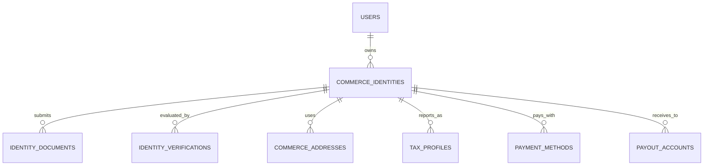

### Tables

| Table | Key columns | Notes |
| --- | --- | --- |
| `commerce_identities` | `commerce_identity_id` PK, `user_id`, `identity_type`, `legal_name_hash`, `verification_status`, `risk_tier`, `created_at` | Person or business commerce persona. |
| `identity_documents` | `document_id` PK, `commerce_identity_id`, `document_type`, `storage_uri`, `checksum`, `status`, `expires_at` | Encrypted object storage artifacts. |
| `identity_verifications` | `verification_id` PK, `commerce_identity_id`, `vendor`, `check_type`, `status`, `decision_code`, `completed_at` | KYC, KYB, sanctions, liveness. |
| `commerce_addresses` | `address_id` PK, `commerce_identity_id`, `address_type`, `encrypted_address`, `country_code`, `region_code`, `postal_code_hash`, `verified_at` | Billing, shipping, registered business. |
| `tax_profiles` | `tax_profile_id` PK, `commerce_identity_id`, `country_code`, `tax_identifier_hash`, `encrypted_tax_identifier`, `status` | Tax reporting and withholding. |
| `payment_methods` | `payment_method_id` PK, `commerce_identity_id`, `provider`, `token`, `method_type`, `status`, `last4`, `expires_at` | Provider-tokenized methods only. |
| `payout_accounts` | `payout_account_id` PK, `commerce_identity_id`, `provider`, `token`, `currency`, `status`, `verified_at` | Bank or wallet payout destinations. |

### Indexes

- `commerce_identities(user_id, verification_status)`.
- `commerce_identities(verification_status, risk_tier, created_at)` for compliance queues.
- `identity_verifications(commerce_identity_id, check_type, completed_at DESC)`.
- `tax_profiles(country_code, tax_identifier_hash)` unique where active.
- `payment_methods(commerce_identity_id, status, method_type)`.
- `payout_accounts(commerce_identity_id, status, currency)`.

### Partitioning

- `identity_verifications` is range-partitioned by `completed_at` by quarter.
- `identity_documents` metadata is partitioned by `created_at`; document binaries live in region-locked object storage.
- Address, tax, and payment tables are region-bound and should not be globally replicated except as redacted compliance projections.

## 3. Reputation system

### Purpose

The reputation system stores explicit reviews, implicit trust signals, transaction outcomes, seller quality, buyer reliability, response behavior, cancellation behavior, and dispute history. Raw events are immutable; aggregate scores are derived and versioned.

### ER diagram

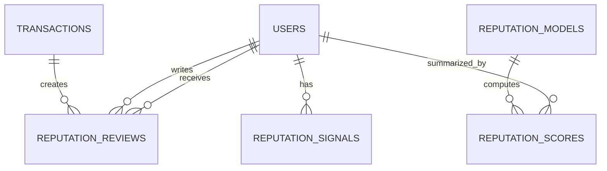

### Tables

| Table | Key columns | Notes |
| --- | --- | --- |
| `reputation_reviews` | `review_id` PK, `transaction_id`, `reviewer_user_id`, `reviewee_user_id`, `rating`, `review_text`, `status`, `created_at` | One review per party per transaction. |
| `reputation_dimensions` | `dimension_id` PK, `code`, `description`, `weight`, `active` | Quality, speed, accuracy, communication. |
| `reputation_review_dimensions` | `review_id`, `dimension_id`, `score` | Composite PK. |
| `reputation_signals` | `signal_id` PK, `user_id`, `signal_type`, `source_type`, `source_id`, `value`, `created_at` | Event-sourced trust facts. |
| `reputation_scores` | `score_id` PK, `user_id`, `model_version`, `overall_score`, `seller_score`, `buyer_score`, `computed_at` | Versioned snapshots. |
| `reputation_model_versions` | `model_version` PK, `feature_manifest`, `deployed_at`, `retired_at` | Score reproducibility. |

### Indexes

- `reputation_reviews(reviewee_user_id, status, created_at DESC)`.
- `reputation_reviews(transaction_id, reviewer_user_id)` unique.
- `reputation_signals(user_id, signal_type, created_at DESC)`.
- `reputation_scores(user_id, computed_at DESC)`.
- `reputation_scores(model_version, overall_score DESC)` for ranking snapshots.

### Partitioning

- `reputation_signals` is monthly range-partitioned by `created_at` and hash-subpartitioned by `user_id` in high-scale regions.
- `reputation_reviews` is yearly range-partitioned by `created_at`.
- `reputation_scores` keeps current scores in a small table and historical score snapshots in monthly partitions.

## 4. Marketplace listings

### Purpose

Listings store sellable inventory, services, rentals, variants, attributes, media, pricing, availability, geography, moderation status, and search indexing state.

### ER diagram

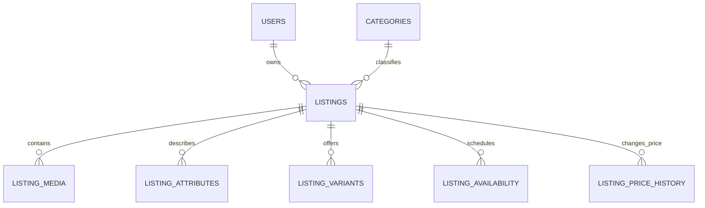

### Tables

| Table | Key columns | Notes |
| --- | --- | --- |
| `categories` | `category_id` PK, `parent_category_id`, `slug`, `name`, `attribute_schema`, `active` | Hierarchical category taxonomy. |
| `listings` | `listing_id` PK, `seller_user_id`, `category_id`, `region_id`, `title`, `description`, `status`, `condition`, `price_amount`, `currency`, `quantity`, `location_geohash`, `created_at`, `updated_at` | Canonical listing. |
| `listing_attributes` | `listing_id`, `attribute_key`, `attribute_value`, `normalized_value` | Composite PK by listing and key. |
| `listing_variants` | `variant_id` PK, `listing_id`, `sku`, `attributes`, `price_amount`, `quantity`, `status` | Optional variants for merchants. |
| `listing_media` | `media_id` PK, `listing_id`, `media_type`, `storage_uri`, `sort_order`, `moderation_status`, `created_at` | Photos, video, documents. |
| `listing_availability` | `availability_id` PK, `listing_id`, `availability_type`, `starts_at`, `ends_at`, `quantity_available` | Rental/service availability. |
| `listing_price_history` | `price_event_id` PK, `listing_id`, `old_price_amount`, `new_price_amount`, `currency`, `changed_at` | Pricing audit and analytics. |
| `listing_events` | `event_id` PK, `listing_id`, `event_type`, `payload`, `created_at` | Outbox and projections. |

### Indexes

- `listings(region_id, status, category_id, created_at DESC)` for browse.
- `listings(seller_user_id, status, updated_at DESC)` for seller inventory.
- `listings(location_geohash, status, category_id)` for local discovery.
- `listings(status, updated_at)` partial index for search reindexing.
- `listing_attributes(attribute_key, normalized_value, listing_id)` for structured filters.
- `listing_media(listing_id, sort_order)`.
- `listing_availability(listing_id, starts_at, ends_at)`.

### Partitioning

- `listings` is hash-partitioned by `listing_id` inside each regional shard when volume requires it.
- `listing_events` and `listing_price_history` are monthly range-partitioned by event time.
- Search-facing denormalized documents are stored in OpenSearch indexes partitioned by `region_id`, `category_id`, and time-based rollover for inactive listings.

## 5. Transactions

### Purpose

Transactions model accepted offers, direct purchases, order state, participants, line items, fulfillment, refunds, returns, disputes, and post-purchase workflows. Transaction state changes are controlled by idempotent commands and state-machine validation.

### ER diagram

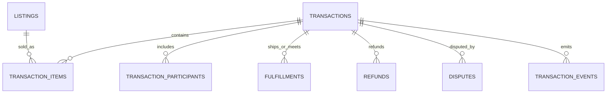

### Tables

| Table | Key columns | Notes |
| --- | --- | --- |
| `transactions` | `transaction_id` PK, `region_id`, `buyer_user_id`, `seller_user_id`, `status`, `purchase_type`, `subtotal_amount`, `fee_amount`, `tax_amount`, `total_amount`, `currency`, `created_at`, `updated_at` | Canonical order record. |
| `transaction_items` | `transaction_item_id` PK, `transaction_id`, `listing_id`, `variant_id`, `title_snapshot`, `quantity`, `unit_price_amount`, `currency` | Immutable purchase snapshot. |
| `transaction_participants` | `transaction_id`, `user_id`, `role`, `commerce_identity_id` | Composite PK. |
| `fulfillments` | `fulfillment_id` PK, `transaction_id`, `fulfillment_type`, `status`, `carrier`, `tracking_number_hash`, `meetup_location_hash`, `estimated_at`, `completed_at` | Shipping, pickup, delivery. |
| `refunds` | `refund_id` PK, `transaction_id`, `amount`, `currency`, `reason_code`, `status`, `created_at` | Links to ledger entries by event. |
| `disputes` | `dispute_id` PK, `transaction_id`, `opened_by_user_id`, `reason_code`, `status`, `resolution`, `opened_at`, `closed_at` | Human and automated resolution. |
| `transaction_events` | `event_id` PK, `transaction_id`, `event_type`, `payload`, `idempotency_key`, `created_at` | Immutable state transitions. |

### Indexes

- `transactions(buyer_user_id, created_at DESC)`.
- `transactions(seller_user_id, created_at DESC)`.
- `transactions(region_id, status, updated_at)` for operations.
- `transaction_items(listing_id, transaction_id)`.
- `transaction_events(transaction_id, created_at)`.
- `transaction_events(idempotency_key)` unique where not null.
- `disputes(status, opened_at)` for queues.

### Partitioning

- `transactions` is region-sharded and monthly range-partitioned by `created_at` after archival thresholds.
- `transaction_events` is monthly range-partitioned by `created_at`.
- `transaction_items` colocates with `transactions` by `transaction_id`.

## 6. Escrow

### Purpose

Escrow secures funds from authorization through hold, release, refund, chargeback, and payout. The ledger is append-only, double-entry, and reconciled against payment service provider statements.

### ER diagram

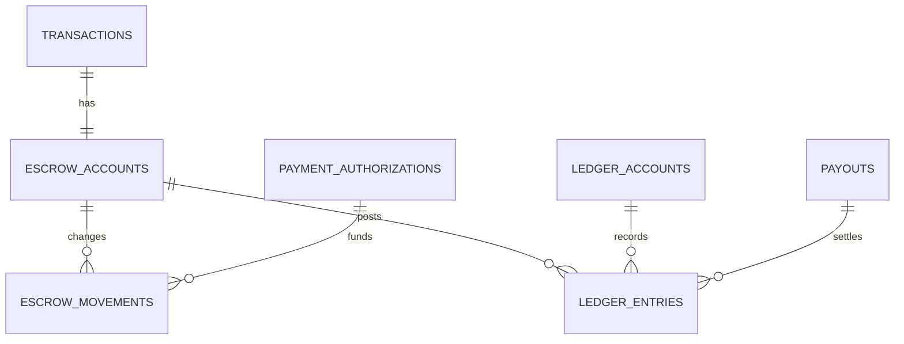

### Tables

| Table | Key columns | Notes |
| --- | --- | --- |
| `escrow_accounts` | `escrow_account_id` PK, `transaction_id` unique, `status`, `currency`, `held_amount`, `released_amount`, `refunded_amount`, `created_at` | Derived balances plus ledger reconciliation. |
| `payment_authorizations` | `authorization_id` PK, `transaction_id`, `payment_method_id`, `provider`, `provider_reference`, `amount`, `currency`, `status`, `authorized_at`, `expires_at` | Payment auth and capture tracking. |
| `escrow_movements` | `movement_id` PK, `escrow_account_id`, `movement_type`, `amount`, `currency`, `status`, `idempotency_key`, `created_at` | Hold, capture, release, refund. |
| `ledger_accounts` | `ledger_account_id` PK, `account_type`, `owner_type`, `owner_id`, `currency`, `status` | Platform cash, seller payable, buyer receivable, fees. |
| `ledger_entries` | `ledger_entry_id` PK, `ledger_transaction_id`, `ledger_account_id`, `direction`, `amount`, `currency`, `transaction_time`, `source_type`, `source_id` | Double-entry rows; debits equal credits per transaction. |
| `payouts` | `payout_id` PK, `seller_user_id`, `payout_account_id`, `amount`, `currency`, `status`, `scheduled_at`, `completed_at` | Seller settlement. |
| `reconciliations` | `reconciliation_id` PK, `provider`, `statement_date`, `status`, `difference_amount`, `completed_at` | Provider statement reconciliation. |

### Indexes

- `escrow_accounts(transaction_id)` unique.
- `escrow_accounts(status, created_at)` for operational queues.
- `payment_authorizations(provider, provider_reference)` unique.
- `escrow_movements(escrow_account_id, created_at)`.
- `escrow_movements(idempotency_key)` unique.
- `ledger_entries(ledger_transaction_id)`.
- `ledger_entries(ledger_account_id, transaction_time DESC)`.
- `payouts(seller_user_id, completed_at DESC)`.
- `reconciliations(provider, statement_date)` unique.

### Partitioning

- `ledger_entries` is monthly range-partitioned by `transaction_time` and hash-subpartitioned by `ledger_account_id`.
- `escrow_movements` is monthly range-partitioned by `created_at`.
- `reconciliations` is partitioned by `statement_date`.

## 7. Offers

### Purpose

Offers support negotiations, counteroffers, buyer commitments, seller acceptances, expirations, and conversion to transactions.

### ER diagram

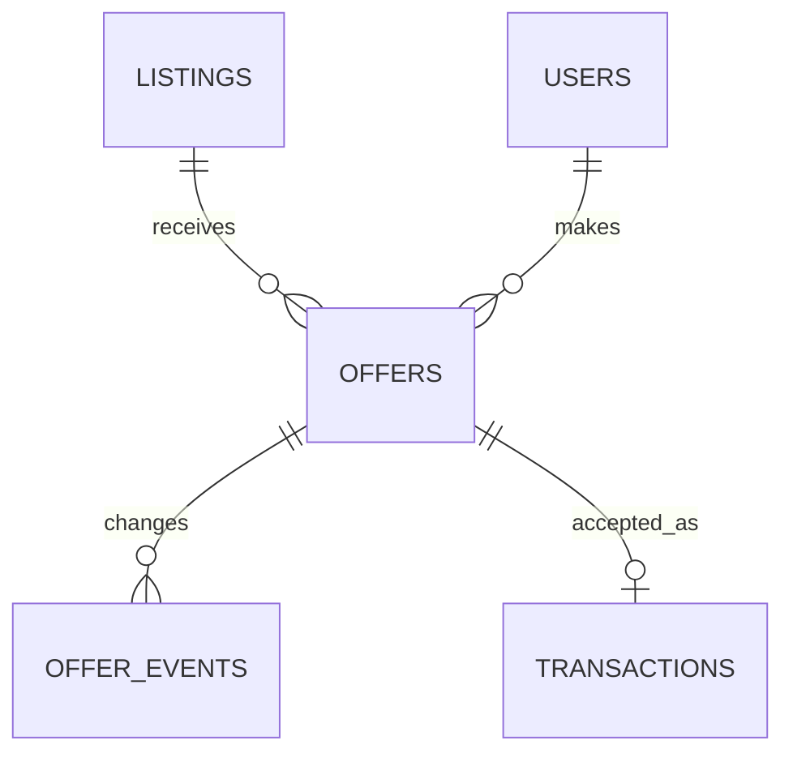

### Tables

| Table | Key columns | Notes |
| --- | --- | --- |
| `offers` | `offer_id` PK, `listing_id`, `buyer_user_id`, `seller_user_id`, `status`, `offer_amount`, `currency`, `quantity`, `message`, `expires_at`, `created_at`, `accepted_at` | Current offer state. |
| `offer_events` | `event_id` PK, `offer_id`, `actor_user_id`, `event_type`, `amount`, `payload`, `created_at` | Offer lifecycle and counteroffers. |
| `offer_reservations` | `reservation_id` PK, `offer_id`, `listing_id`, `quantity_reserved`, `expires_at`, `status` | Prevents oversell after acceptance window. |

### Indexes

- `offers(listing_id, status, created_at DESC)`.
- `offers(buyer_user_id, status, created_at DESC)`.
- `offers(seller_user_id, status, created_at DESC)`.
- `offers(expires_at, status)` for expiration jobs.
- `offer_events(offer_id, created_at)`.
- `offer_reservations(listing_id, status, expires_at)`.

### Partitioning

- `offer_events` is monthly range-partitioned by `created_at`.
- `offers` can be hash-partitioned by `listing_id` when negotiation volume is high.

## 8. Messaging

### Purpose

Messaging supports buyer-seller conversations, transaction communication, attachments, moderation, safety interventions, read receipts, and agent-authored messages.

### ER diagram

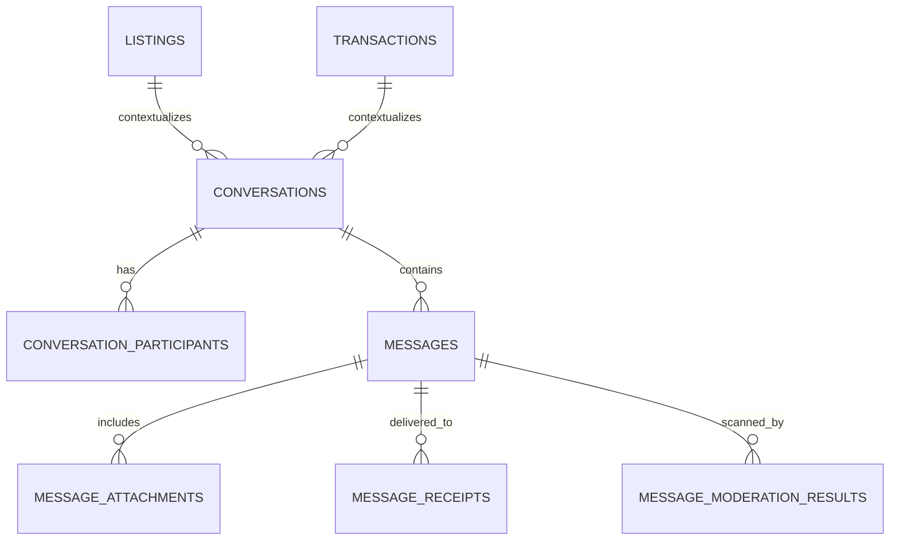

### Tables

| Table | Key columns | Notes |
| --- | --- | --- |
| `conversations` | `conversation_id` PK, `conversation_type`, `listing_id`, `transaction_id`, `status`, `created_at`, `last_message_at` | Thread container. |
| `conversation_participants` | `conversation_id`, `user_id`, `role`, `joined_at`, `left_at`, `muted_until` | Composite PK. |
| `messages` | `message_id` PK, `conversation_id`, `sender_user_id`, `sender_agent_id`, `message_type`, `body`, `status`, `created_at`, `edited_at`, `deleted_at` | Ordered by conversation and created time. |
| `message_attachments` | `attachment_id` PK, `message_id`, `media_type`, `storage_uri`, `checksum`, `created_at` | Media in object storage. |
| `message_receipts` | `message_id`, `user_id`, `delivered_at`, `read_at` | Composite PK. |
| `message_moderation_results` | `moderation_id` PK, `message_id`, `model_version`, `risk_labels`, `action`, `created_at` | Safety scanning. |

### Indexes

- `conversations(last_message_at DESC)` for operational maintenance.
- `conversation_participants(user_id, left_at, conversation_id)` for inbox.
- `messages(conversation_id, created_at DESC, message_id DESC)` for thread pagination.
- `messages(sender_user_id, created_at DESC)` for abuse review.
- `message_receipts(user_id, read_at)` for unread counts.
- `message_moderation_results(action, created_at)` for review queues.

### Partitioning

- `messages` is hash-partitioned by `conversation_id` and range-partitioned by `created_at` for archival.
- `message_receipts` colocates with messages by `message_id` where possible.
- Attachments live in object storage with lifecycle policies by retention class.

## 9. Fraud intelligence

### Purpose

Fraud intelligence stores raw risk events, device associations, graph links, model scores, rule decisions, sanctions signals, fraud cases, and investigator outcomes. It supports both realtime risk decisions and offline model training.

### ER diagram

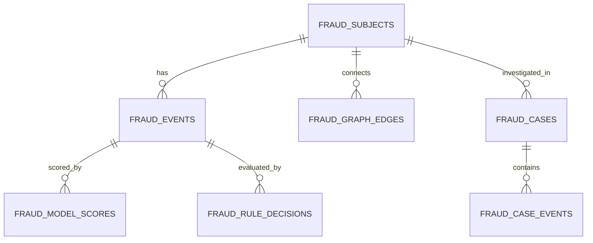

### Tables

| Table | Key columns | Notes |
| --- | --- | --- |
| `fraud_subjects` | `fraud_subject_id` PK, `subject_type`, `subject_id`, `region_id`, `created_at` | User, listing, transaction, device, payment method. |
| `fraud_events` | `fraud_event_id` PK, `fraud_subject_id`, `event_type`, `source`, `payload`, `risk_level`, `created_at` | Raw intelligence facts. |
| `fraud_graph_edges` | `edge_id` PK, `from_subject_id`, `to_subject_id`, `edge_type`, `confidence`, `first_seen_at`, `last_seen_at` | Device, payment, address, behavior links. |
| `fraud_model_scores` | `score_id` PK, `fraud_event_id`, `model_name`, `model_version`, `score`, `explanations`, `created_at` | Risk model outputs. |
| `fraud_rule_decisions` | `decision_id` PK, `fraud_event_id`, `rule_id`, `decision`, `reason`, `created_at` | Deterministic rule results. |
| `fraud_cases` | `case_id` PK, `primary_subject_id`, `status`, `priority`, `assigned_to`, `opened_at`, `closed_at`, `outcome` | Investigator workflow. |
| `fraud_case_events` | `case_event_id` PK, `case_id`, `actor_id`, `event_type`, `payload`, `created_at` | Case history. |

### Indexes

- `fraud_subjects(subject_type, subject_id)` unique.
- `fraud_events(fraud_subject_id, created_at DESC)`.
- `fraud_events(event_type, risk_level, created_at DESC)`.
- `fraud_graph_edges(from_subject_id, edge_type, last_seen_at DESC)`.
- `fraud_graph_edges(to_subject_id, edge_type, last_seen_at DESC)`.
- `fraud_model_scores(model_name, model_version, score DESC, created_at)`.
- `fraud_cases(status, priority, opened_at)`.

### Partitioning

- `fraud_events`, `fraud_model_scores`, `fraud_rule_decisions`, and `fraud_case_events` are monthly range-partitioned by `created_at`.
- Graph edges are hash-partitioned by `from_subject_id`.
- Hot realtime features are mirrored into an online feature store keyed by subject and feature namespace.

## 10. AI recommendations

### Purpose

AI recommendations store user, listing, and intent features; embeddings; generated recommendation candidates; ranking outputs; feedback; and model metadata. Recommendation outputs are treated as ephemeral projections, while feedback and model metadata are durable.

### ER diagram

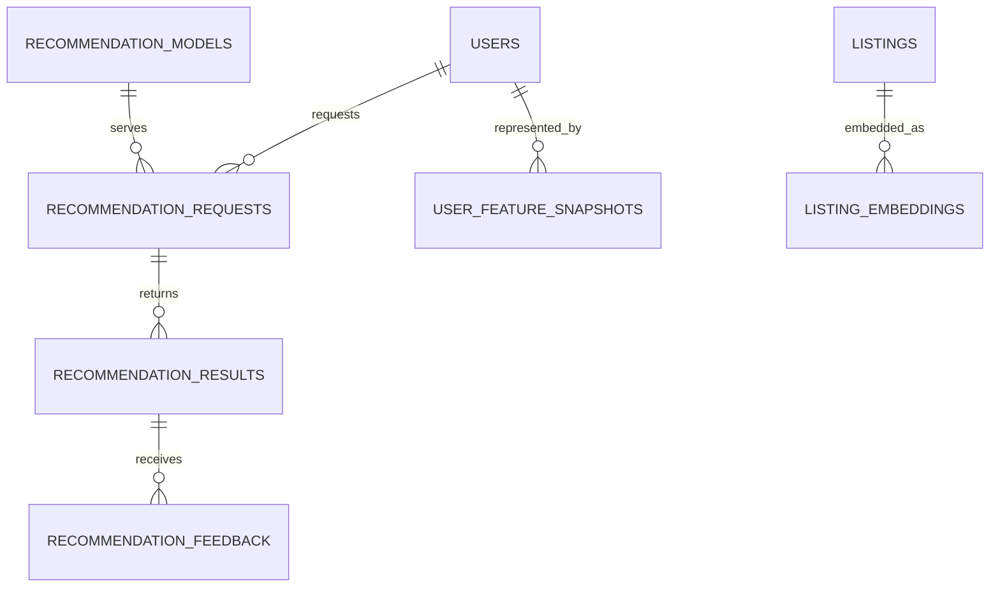

### Tables

| Table | Key columns | Notes |
| --- | --- | --- |
| `recommendation_models` | `model_id` PK, `model_name`, `model_version`, `artifact_uri`, `feature_manifest`, `deployed_at`, `retired_at` | Model registry projection. |
| `user_feature_snapshots` | `snapshot_id` PK, `user_id`, `feature_namespace`, `features`, `computed_at` | Offline and online feature sync. |
| `listing_embeddings` | `embedding_id` PK, `listing_id`, `model_version`, `embedding_vector`, `computed_at` | Vector search or pgvector. |
| `intent_embeddings` | `embedding_id` PK, `saved_intent_id`, `model_version`, `embedding_vector`, `computed_at` | Semantic matching for saved intents. |
| `recommendation_requests` | `request_id` PK, `user_id`, `surface`, `context`, `model_id`, `created_at` | Request log. |
| `recommendation_results` | `result_id` PK, `request_id`, `listing_id`, `rank`, `score`, `reason_codes` | Ranked candidates. |
| `recommendation_feedback` | `feedback_id` PK, `request_id`, `user_id`, `listing_id`, `feedback_type`, `created_at` | Clicks, hides, saves, purchases. |

### Indexes

- `user_feature_snapshots(user_id, feature_namespace, computed_at DESC)`.
- `listing_embeddings(listing_id, model_version)` unique.
- Approximate nearest-neighbor index on `listing_embeddings.embedding_vector`.
- `recommendation_requests(user_id, surface, created_at DESC)`.
- `recommendation_results(request_id, rank)`.
- `recommendation_feedback(user_id, feedback_type, created_at DESC)`.

### Partitioning

- Request, result, and feedback logs are daily or monthly range-partitioned by `created_at` depending on traffic.
- Embedding indexes are partitioned by `region_id`, `category_id`, and `model_version` in the vector store.
- Feature snapshots keep only the latest online row in OLTP and full history in the lakehouse.

## 11. Notifications

### Purpose

Notifications manage user preferences, templates, delivery attempts, provider receipts, in-app notification state, quiet hours, and compliance unsubscribes.

### ER diagram

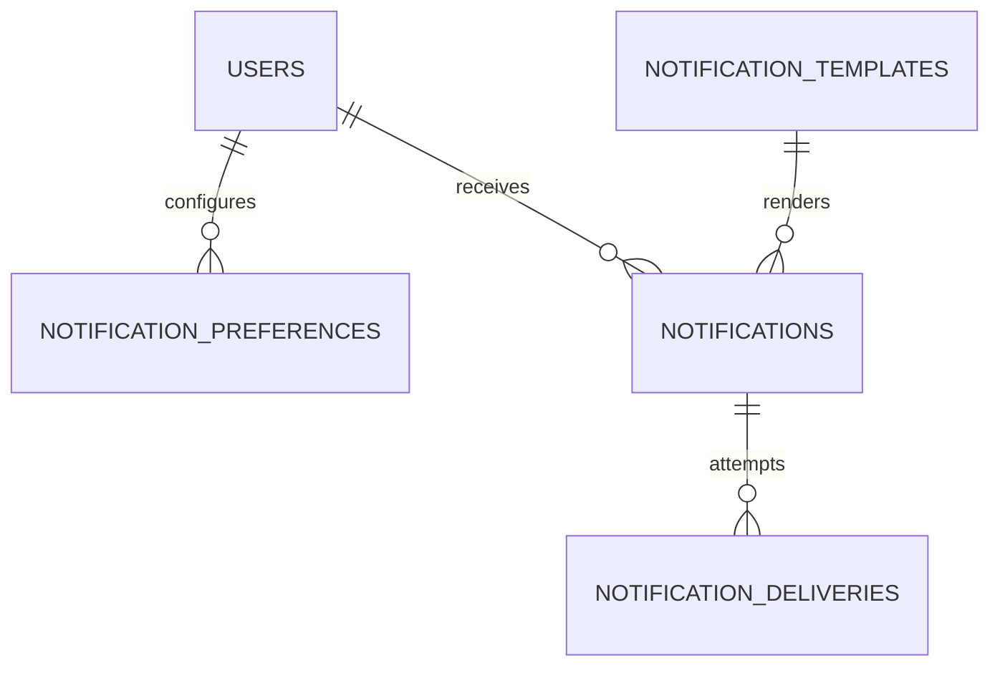

### Tables

| Table | Key columns | Notes |
| --- | --- | --- |
| `notification_preferences` | `user_id`, `channel`, `notification_type`, `enabled`, `quiet_hours`, `updated_at` | Composite PK. |
| `notification_templates` | `template_id` PK, `notification_type`, `channel`, `locale`, `version`, `body_template`, `active` | Versioned content. |
| `notifications` | `notification_id` PK, `user_id`, `template_id`, `notification_type`, `priority`, `payload`, `status`, `created_at`, `expires_at` | User-visible notification. |
| `notification_deliveries` | `delivery_id` PK, `notification_id`, `channel`, `provider`, `provider_message_id`, `status`, `attempted_at`, `delivered_at` | Delivery attempts and receipts. |
| `notification_tokens` | `token_id` PK, `user_id`, `channel`, `provider`, `token_hash`, `encrypted_token`, `status`, `last_used_at` | Push/email/SMS routing tokens. |

### Indexes

- `notification_preferences(user_id, channel, notification_type)` unique.
- `notifications(user_id, status, created_at DESC)`.
- `notifications(status, priority, created_at)` for dispatchers.
- `notification_deliveries(notification_id, attempted_at DESC)`.
- `notification_deliveries(provider, provider_message_id)`.
- `notification_tokens(user_id, channel, status)`.

### Partitioning

- `notifications` and `notification_deliveries` are monthly range-partitioned by creation or attempt time.
- Expired notifications are compacted into aggregate analytics after retention.

## 12. Saved intents

### Purpose

Saved intents capture buyer demand before a listing is selected. They power alerts, agent workflows, reverse matching, demand forecasting, and recommendation retrieval.

### ER diagram

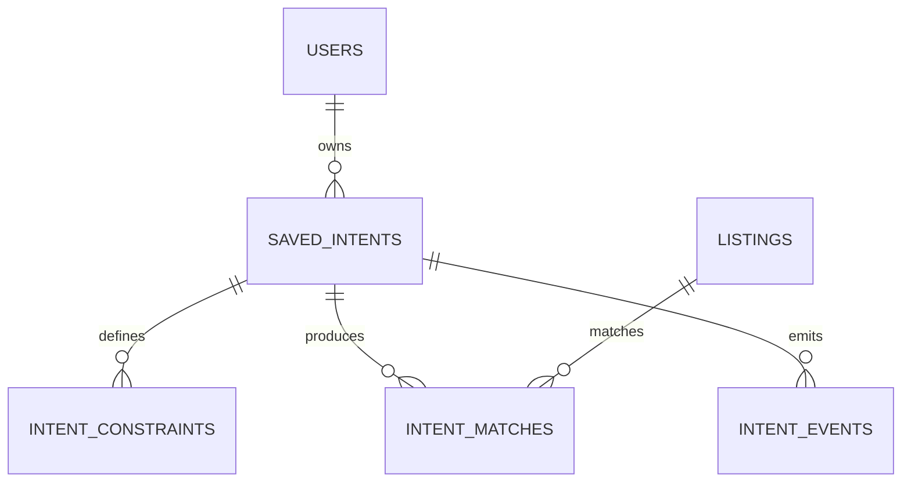

### Tables

| Table | Key columns | Notes |
| --- | --- | --- |
| `saved_intents` | `saved_intent_id` PK, `user_id`, `intent_type`, `title`, `natural_language_query`, `status`, `budget_min`, `budget_max`, `currency`, `location_geohash`, `radius_km`, `created_at`, `expires_at` | Durable buyer demand object. |
| `intent_constraints` | `constraint_id` PK, `saved_intent_id`, `constraint_key`, `operator`, `constraint_value`, `weight` | Structured filters. |
| `intent_matches` | `match_id` PK, `saved_intent_id`, `listing_id`, `match_score`, `status`, `matched_at`, `notified_at` | Matching projection. |
| `intent_events` | `event_id` PK, `saved_intent_id`, `event_type`, `payload`, `created_at` | Lifecycle and feedback. |

### Indexes

- `saved_intents(user_id, status, created_at DESC)`.
- `saved_intents(status, expires_at)` for expiry.
- `saved_intents(location_geohash, status)` for local matching.
- `intent_constraints(constraint_key, constraint_value)`.
- `intent_matches(saved_intent_id, match_score DESC)`.
- `intent_matches(listing_id, status, matched_at DESC)`.

### Partitioning

- `intent_events` and `intent_matches` are monthly range-partitioned by time.
- Semantic intent indexes are partitioned by region and category inferred from constraints.

## 13. Buyer agents

### Purpose

Buyer agents act on behalf of buyers within explicit permissions. They can monitor saved intents, recommend listings, draft messages, negotiate offers within budget, schedule inspections, and escalate risky decisions.

### ER diagram

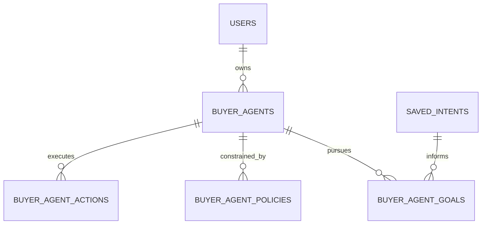

### Tables

| Table | Key columns | Notes |
| --- | --- | --- |
| `buyer_agents` | `buyer_agent_id` PK, `owner_user_id`, `name`, `status`, `model_id`, `created_at`, `last_active_at` | User-owned automation. |
| `buyer_agent_goals` | `goal_id` PK, `buyer_agent_id`, `saved_intent_id`, `goal_type`, `target_state`, `priority`, `status`, `created_at` | Find, compare, negotiate, purchase. |
| `buyer_agent_policies` | `policy_id` PK, `buyer_agent_id`, `policy_type`, `policy_value`, `requires_confirmation`, `created_at` | Budget, geography, risk, messaging. |
| `buyer_agent_actions` | `action_id` PK, `buyer_agent_id`, `goal_id`, `action_type`, `target_type`, `target_id`, `status`, `input_payload`, `output_payload`, `created_at` | Tool-call audit. |
| `buyer_agent_memory` | `memory_id` PK, `buyer_agent_id`, `memory_type`, `content`, `embedding_vector`, `created_at`, `expires_at` | Permissioned personalization memory. |

### Indexes

- `buyer_agents(owner_user_id, status, last_active_at DESC)`.
- `buyer_agent_goals(buyer_agent_id, status, priority)`.
- `buyer_agent_goals(saved_intent_id, status)`.
- `buyer_agent_actions(buyer_agent_id, created_at DESC)`.
- `buyer_agent_actions(target_type, target_id, action_type)`.
- Vector index on `buyer_agent_memory.embedding_vector` when semantic memory is enabled.

### Partitioning

- `buyer_agent_actions` is monthly range-partitioned by `created_at`.
- `buyer_agent_memory` is partitioned by `buyer_agent_id` hash and retention class.

## 14. Seller agents

### Purpose

Seller agents help sellers create listings, optimize prices, manage inventory, respond to buyers, negotiate offers, promote inventory, and forecast demand under explicit seller policies.

### ER diagram

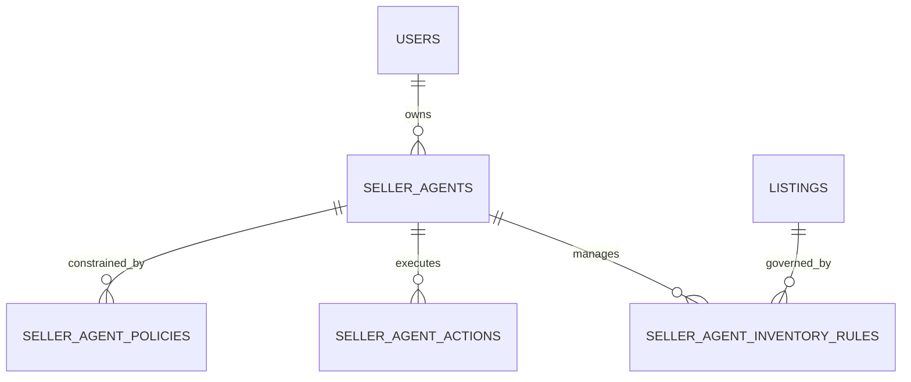

### Tables

| Table | Key columns | Notes |
| --- | --- | --- |
| `seller_agents` | `seller_agent_id` PK, `owner_user_id`, `commerce_identity_id`, `name`, `status`, `model_id`, `created_at`, `last_active_at` | Seller-owned automation. |
| `seller_agent_policies` | `policy_id` PK, `seller_agent_id`, `policy_type`, `policy_value`, `requires_confirmation`, `created_at` | Pricing floors, discount caps, response tone. |
| `seller_agent_inventory_rules` | `rule_id` PK, `seller_agent_id`, `listing_id`, `rule_type`, `rule_value`, `status`, `created_at` | Dynamic pricing, relisting, bundling. |
| `seller_agent_actions` | `action_id` PK, `seller_agent_id`, `action_type`, `target_type`, `target_id`, `status`, `input_payload`, `output_payload`, `created_at` | Tool-call audit. |
| `seller_agent_memory` | `memory_id` PK, `seller_agent_id`, `memory_type`, `content`, `embedding_vector`, `created_at`, `expires_at` | Seller preferences and playbooks. |

### Indexes

- `seller_agents(owner_user_id, status, last_active_at DESC)`.
- `seller_agents(commerce_identity_id, status)`.
- `seller_agent_policies(seller_agent_id, policy_type)`.
- `seller_agent_inventory_rules(listing_id, status)`.
- `seller_agent_actions(seller_agent_id, created_at DESC)`.
- `seller_agent_actions(target_type, target_id, action_type)`.

### Partitioning

- `seller_agent_actions` is monthly range-partitioned by `created_at`.
- Inventory rules colocate with seller agent ownership and are small enough for standard indexing until merchant scale requires seller-based sharding.

## 15. Analytics

### Purpose

Analytics stores immutable business events, derived facts, dimensions, funnels, experiments, attribution, marketplace liquidity metrics, cohort metrics, and financial reporting extracts. OLTP systems emit events; analytics systems never become the source of truth for operational workflows.

### ER diagram

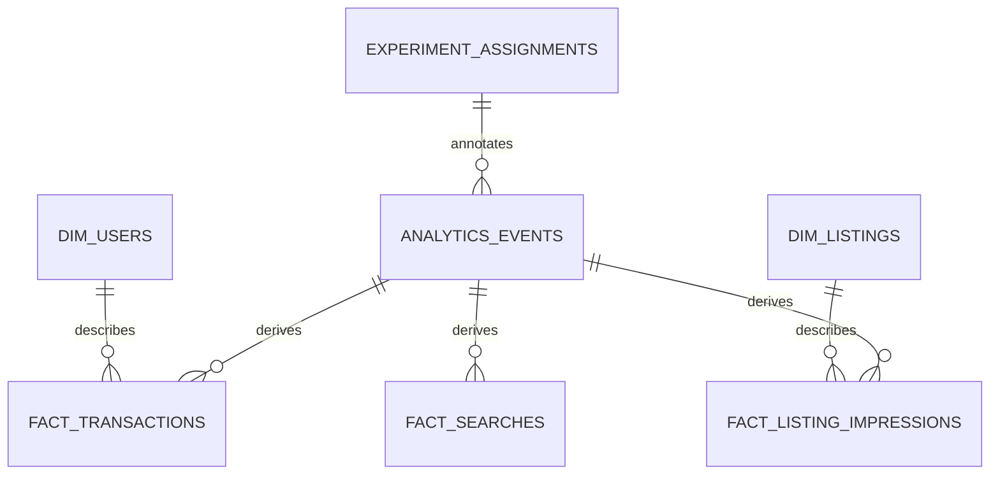

### Tables

| Table | Key columns | Notes |
| --- | --- | --- |
| `analytics_events` | `event_id`, `event_name`, `user_id`, `session_id`, `region_id`, `properties`, `event_time`, `ingested_at` | Raw event lake table. |
| `dim_users` | `user_sk`, `user_id`, `home_region_id`, `account_type`, `created_date`, `is_deleted` | Slowly changing dimension. |
| `dim_listings` | `listing_sk`, `listing_id`, `seller_user_id`, `category_id`, `region_id`, `created_date`, `status` | Listing dimension. |
| `fact_transactions` | `transaction_id`, `buyer_user_id`, `seller_user_id`, `gross_amount`, `fee_amount`, `currency`, `transaction_time` | Financial and marketplace GMV facts. |
| `fact_listing_impressions` | `impression_id`, `user_id`, `listing_id`, `surface`, `rank`, `event_time` | Discovery performance. |
| `fact_searches` | `search_id`, `user_id`, `query`, `filters`, `result_count`, `event_time` | Search quality. |
| `experiment_assignments` | `assignment_id`, `user_id`, `experiment_key`, `variant_key`, `assigned_at` | Experiment analysis. |

### Indexes and clustering

- Lakehouse tables are partitioned by event date and region.
- Warehouse facts cluster by high-cardinality join keys such as `user_id`, `listing_id`, and `transaction_id`.
- `fact_transactions` is clustered by `transaction_time`, `region_id`, and `currency`.
- `fact_listing_impressions` is clustered by `listing_id`, `surface`, and `event_time`.

### Partitioning

- Raw analytics events are daily partitioned by `event_time` and region.
- Facts are daily or monthly partitioned based on volume.
- Dimensions use type-2 slowly changing records with validity windows.

## 16. Audit logs

### Purpose

Audit logs capture administrator actions, service-to-service privileged operations, policy decisions, AI tool calls, data access, identity verification decisions, payment state transitions, and security events. They must be immutable, tamper-evident, and independently queryable.

### ER diagram

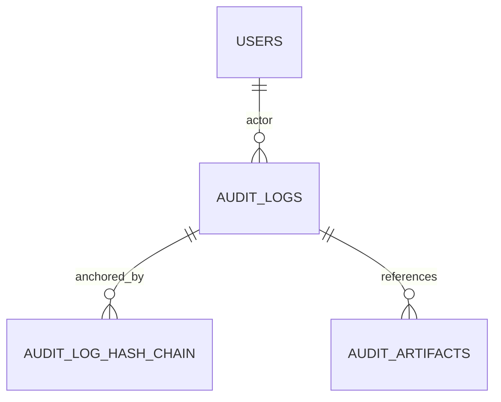

### Tables

| Table | Key columns | Notes |
| --- | --- | --- |
| `audit_logs` | `audit_log_id` PK, `actor_type`, `actor_id`, `action`, `resource_type`, `resource_id`, `decision`, `ip_hash`, `user_agent_hash`, `payload`, `created_at` | Indexed metadata and event body. |
| `audit_artifacts` | `artifact_id` PK, `audit_log_id`, `artifact_type`, `storage_uri`, `checksum`, `created_at` | Evidence and large payloads. |
| `audit_log_hash_chain` | `chain_id` PK, `scope`, `period_start`, `period_end`, `previous_hash`, `current_hash`, `anchored_at` | Tamper-evidence. |

### Indexes

- `audit_logs(actor_type, actor_id, created_at DESC)`.
- `audit_logs(resource_type, resource_id, created_at DESC)`.
- `audit_logs(action, decision, created_at DESC)`.
- `audit_logs(created_at)` for partition pruning.
- `audit_log_hash_chain(scope, period_start)` unique.

### Partitioning

- `audit_logs` is monthly range-partitioned by `created_at` and optionally hash-subpartitioned by `resource_id`.
- Immutable copies are written to object storage with write-once-read-many controls and retention locks.

## Cross-domain indexing strategy

| Access pattern | Primary serving path | Supporting index or projection |
| --- | --- | --- |
| User login by email or phone | User database | Unique hash indexes on verified email and phone. |
| Public profile fetch | User database and cache | `user_profiles(user_id)` plus Redis cache. |
| Seller inventory page | Listings database | `listings(seller_user_id, status, updated_at DESC)`. |
| Local category browse | Search index | Search index by region, geohash, category, status, price. |
| Listing detail page | Listings database and cache | `listings(listing_id)`, media by listing. |
| Buyer offer inbox | Offers database | `offers(buyer_user_id, status, created_at DESC)`. |
| Seller offer inbox | Offers database | `offers(seller_user_id, status, created_at DESC)`. |
| Conversation inbox | Messaging database | `conversation_participants(user_id, left_at, conversation_id)`. |
| Transaction history | Transaction database | Buyer and seller transaction indexes. |
| Escrow balance | Ledger database | Escrow by transaction plus ledger account time index. |
| Fraud investigation | Fraud case database and graph | Subject unique index, graph edge indexes, case queue index. |
| Recommendations | Recommendation service | Vector ANN indexes, feature store keys, feedback partitions. |
| Notifications inbox | Notification database | `notifications(user_id, status, created_at DESC)`. |
| Audit search | Audit metadata database | Actor, resource, action, decision, and time indexes. |

## Partitioning strategy

### Partitioning rules

1. Partition only tables with clear volume, retention, or maintenance needs.
2. Prefer time-range partitions for immutable events and logs.
3. Prefer hash partitions for high-cardinality hot keys such as conversation, user, listing, transaction, and ledger account.
4. Keep parent records and child records colocated when transaction boundaries require joins.
5. Avoid partitioning small reference tables such as categories, dimensions, templates, and policy definitions.

### Partitioning matrix

| Domain | Tables | Partition key | Retention action |
| --- | --- | --- | --- |
| User | `user_sessions`, `account_events` | Time | Delete or archive expired sessions; retain account events by policy. |
| Commerce identity | `identity_verifications`, document metadata | Time | Archive after compliance period; retain encrypted artifacts as required. |
| Reputation | `reputation_signals`, review history | Time plus user hash | Aggregate and compact older signals. |
| Listings | `listing_events`, price history | Time | Archive inactive listing events. |
| Transactions | `transaction_events`, older transactions | Time plus transaction hash | Cold archive after financial retention window. |
| Escrow | `ledger_entries`, movements | Time plus ledger account hash | Never mutate; archive closed periods with reconciliation checkpoints. |
| Offers | `offer_events` | Time | Archive expired negotiations. |
| Messaging | `messages`, receipts | Conversation hash plus time | Retain by trust, legal, and user deletion policies. |
| Fraud | Events, scores, case events | Time plus subject hash | Retain high-risk evidence longer. |
| AI | Requests, results, feedback | Time | Compact raw results; retain feedback. |
| Notifications | Notifications and deliveries | Time | Delete expired notification bodies. |
| Analytics | Raw events and facts | Event date plus region | Tier to cheaper storage. |
| Audit | Audit logs | Time plus resource hash | WORM retention and legal hold support. |

## Sharding strategy

### Regional cells

The first-level shard is the **regional cell**. Users have a `home_region_id`, listings have a `region_id`, and most buyer-seller activity is routed to the listing region. Regional cells own low-latency marketplace workflows and reduce cross-region data movement.

### Service-local shards

Within each regional cell, services shard independently using the most common access key:

| Service | Shard key | Rationale |
| --- | --- | --- |
| User | `user_id` | User-centric account operations. |
| Commerce identity | `commerce_identity_id` or `user_id` | Keeps verification records close to owner. |
| Listings | `listing_id`; secondary routing by `seller_user_id` | Balances hot categories while preserving seller inventory access through indexes. |
| Offers | `listing_id` | Negotiations are listing-centric. |
| Transactions | `transaction_id` with region affinity | Ensures transaction workflow locality. |
| Escrow ledger | `ledger_account_id` and `transaction_id` | Balances posting volume while preserving account history queries. |
| Messaging | `conversation_id` | Maintains per-conversation ordering. |
| Fraud | `fraud_subject_id` | Supports subject-centric risk history. |
| Notifications | `user_id` | User inbox and preferences are user-centric. |
| Agents | `owner_user_id` | Delegated workflows are owner-centric. |
| Audit | `resource_id` plus time | Investigations are resource and time based. |

### Cross-shard operations

- Use sagas and Temporal workflows for operations spanning listings, offers, transactions, escrow, notifications, fraud, and messaging.
- Use idempotency keys on every externally retried command.
- Use a transactional outbox per service database to publish events after commit.
- Use read models for cross-domain pages rather than distributed joins.
- Keep financial ledger postings in one strongly consistent ledger boundary, even when the product transaction involves multiple regional projections.

### Rebalancing

- New shards are added by consistent hashing with virtual buckets.
- Routing tables map virtual buckets to physical shards and are versioned.
- Large merchants, extremely hot listings, or viral conversations can be moved to dedicated shards through live dual-write plus backfill cutovers.
- Historical partitions remain on old shards unless query pressure justifies relocation.

## Scaling strategy

### OLTP scaling

1. **Read scaling**: Use regional read replicas for profile, listing, transaction history, and notification inbox reads that tolerate replica lag.
2. **Write scaling**: Scale writes by service-local shard keys and regional cell expansion, not by creating one global write master.
3. **Connection scaling**: Use connection pooling, bounded service concurrency, backpressure, and request shedding during spikes.
4. **Hot row avoidance**: Store aggregate counters as asynchronous projections or striped counters rather than updating one row on every event.
5. **Archival**: Move cold events, messages, ledger closed periods, and audit logs to cheaper storage while preserving queryable metadata.

### Search and browse scaling

- Listings are indexed asynchronously from listing events.
- Search indexes are regional and category-aware.
- High-cardinality filters are normalized into structured listing attributes.
- Reindexing uses versioned index aliases and blue-green index swaps.
- Listing detail pages use cache-aside with explicit invalidation on listing events.

### Messaging scaling

- Conversation writes are routed by `conversation_id` to preserve ordering.
- Fanout for read receipts, push notifications, moderation, and analytics is asynchronous.
- Attachments bypass databases and go directly to object storage using signed upload URLs.
- Very large group or broadcast threads use fanout-on-read projections instead of per-recipient writes at send time.

### Financial scaling

- Escrow and ledger are isolated from marketplace browse traffic.
- Ledger entries are append-only and posted through idempotent ledger transactions.
- Balances are materialized from ledger entries and continuously reconciled.
- Payment provider callbacks are deduplicated by provider reference and idempotency keys.
- Closed ledger periods are immutable and hash-anchored.

### Fraud and AI scaling

- Fraud decisions use online features with strict freshness budgets.
- Full fraud history is stored in event partitions and graph stores for investigation and offline modeling.
- Recommendations use batch candidate generation plus realtime reranking.
- Embeddings are versioned so model upgrades can run side-by-side.
- AI agent actions are recorded as auditable tool calls and constrained by policy rows.

### Analytics scaling

- Domain events land in Kafka and object storage before warehouse transformation.
- Raw events are immutable; transformations produce versioned facts and dimensions.
- Cost is controlled through partition pruning, compaction, clustering, and tiered storage.
- Product metrics use certified semantic models rather than ad hoc production database queries.

### Resilience and disaster recovery

- Each regional cell can run independently for core browse, listing, messaging, and transaction workflows.
- Global account and risk services expose degraded-mode decisions when cross-region dependencies fail.
- Escrow and ledger use synchronous replication within the financial consistency boundary and explicit failover runbooks.
- Backups are encrypted, regularly restored in drills, and validated against checksums and ledger invariants.
- Event replay can rebuild search, recommendations, fraud features, reputation scores, notification status projections, and analytics facts.

## Data governance, privacy, and retention

| Data class | Storage control | Retention posture |
| --- | --- | --- |
| Public marketplace data | Regional OLTP, search, cache | Retain while active; archive inactive listings. |
| PII | Encrypted regional stores with strict access controls | Minimize, tokenize, delete or anonymize subject to law. |
| Payment data | Provider tokens and ledger records | Never store raw card or bank secrets; retain financial records as required. |
| Identity documents | Encrypted object storage | Retain by KYC/KYB and legal requirements. |
| Messages | Regional message store and object storage | User deletion plus safety/legal retention exceptions. |
| Fraud intelligence | Fraud event store and graph | Longer retention for confirmed abuse and chargebacks. |
| AI memory | User-permissioned stores | Expire by policy and delete on consent revocation. |
| Audit logs | WORM object storage and metadata index | Immutable retention and legal hold support. |

## Event backbone

Every source-of-truth service emits typed events using a transactional outbox. Event topics are scoped by domain and region, with schema evolution enforced by compatibility checks.

| Domain | Example events |
| --- | --- |
| User | `user.created`, `user.email_verified`, `user.suspended`, `consent.revoked` |
| Identity | `identity.verification_started`, `identity.verified`, `tax_profile.updated` |
| Listing | `listing.created`, `listing.updated`, `listing.published`, `listing.removed` |
| Offer | `offer.created`, `offer.countered`, `offer.accepted`, `offer.expired` |
| Transaction | `transaction.created`, `transaction.completed`, `refund.created`, `dispute.opened` |
| Escrow | `escrow.funds_held`, `escrow.released`, `ledger.posted`, `payout.completed` |
| Messaging | `message.sent`, `message.flagged`, `message.read` |
| Fraud | `fraud.event_recorded`, `risk.decision_made`, `fraud_case.closed` |
| AI | `recommendation.served`, `agent.action_requested`, `agent.action_completed` |
| Notification | `notification.created`, `notification.delivered`, `notification.failed` |
| Audit | `audit.recorded`, `audit.hash_chain_anchored` |

## Implementation roadmap

1. **Phase 1: Core marketplace OLTP**: Build users, commerce identity, listings, offers, transactions, escrow ledger, notifications, and audit logs in a single primary region with clean service boundaries.
2. **Phase 2: Event projections**: Add transactional outbox, search projections, reputation aggregates, analytics ingestion, and notification dispatch projections.
3. **Phase 3: Trust and intelligence**: Add fraud graph, feature store, recommendation embeddings, saved intents, and AI agent audit tables.
4. **Phase 4: Regional cells**: Introduce region-aware routing, data residency policies, service-local shards, and regional search indexes.
5. **Phase 5: Global scale**: Add active-active regional cells, ledger-grade distributed SQL for financial domains, automated shard rebalancing, global analytics, and mature disaster recovery drills.
