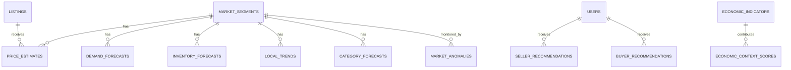

# Real-Time Market Intelligence Platform Architecture

## Executive summary

This document designs a real-time market intelligence platform for an AI-powered marketplace. The platform understands supply, demand, price movement, inventory risk, category dynamics, local market conditions, seasonal behavior, seller opportunity, buyer intent, anomalies, and macroeconomic pressure across regional marketplace cells.

The goal is to convert marketplace activity into actionable intelligence for users, agents, operations teams, and automated systems while preserving privacy, fairness, explainability, trust, and financial correctness.

The platform supports ten core capabilities:

1. **Price prediction** for listings, offers, reserve prices, markdowns, and negotiation guidance.
2. **Demand forecasting** for categories, items, locations, cohorts, and fulfillment modes.
3. **Inventory forecasting** for available supply, sell-through, stockouts, oversupply, and replenishment needs.
4. **Seasonal forecasting** for calendar events, weather, school cycles, holidays, tourism, and local events.
5. **Local market trends** for neighborhood-level price, liquidity, intent, and supply shifts.
6. **Seller recommendations** for pricing, listing quality, timing, promotion, bundling, fulfillment, and sourcing.
7. **Buyer recommendations** for personalized discovery, substitutes, alerts, total-cost optimization, and safe purchase timing.
8. **Market anomaly detection** for fraud spikes, price manipulation, scarcity shocks, demand surges, listing floods, and operational incidents.
9. **Category forecasting** for category-level growth, assortment gaps, liquidity, conversion, and monetization opportunities.
10. **Economic intelligence** for macro, regional, and marketplace-specific signals that explain changes in behavior and risk.

For the broader marketplace platform architecture, see [Technical Architecture](technical-architecture.md). For the logical and physical data foundation, see [Database Architecture](database-architecture.md). For agent workflows that consume this intelligence, see [AI Agent Ecosystem](ai-agent-ecosystem.md).

## Architecture principles

1. **Realtime where decisions are perishable**: Pricing, anomaly detection, recommendations, and local trend surfaces update continuously from event streams.
2. **Batch where stability matters**: Long-horizon demand, seasonal, category, and macro forecasts are trained and recalibrated through governed batch pipelines.
3. **Every prediction has context**: Model outputs include confidence, reason codes, comparable evidence, training window, feature freshness, and policy flags.
4. **Locality is first-class**: Forecasts are segmented by region, city, neighborhood, category, condition, fulfillment mode, and marketplace liquidity state.
5. **Human and agent actionability**: Predictions are converted into recommended actions, not just dashboards.
6. **Causal discipline over vanity correlation**: Use experiments, quasi-experimental methods, uplift models, and counterfactual evaluation before automating high-impact interventions.
7. **Privacy-preserving intelligence**: Aggregate signals, differential privacy, consent controls, regional data residency, and purpose limitation govern all market-level insights.
8. **Fairness and anti-manipulation**: Recommendations must not enable collusion, discriminatory pricing, exploitative scarcity, or unsafe buyer/seller behavior.
9. **Resilience through degradation**: If realtime features or models fail, services fall back to cached forecasts, static price bands, rules, and safe defaults.
10. **Closed-loop learning**: Every recommendation is tracked through exposure, user action, transaction outcome, satisfaction, dispute, and long-term marketplace health.

## Capability-to-system map

| Capability | Primary models | Primary data products | Realtime path | Batch path | Main consumers |
| --- | --- | --- | --- | --- | --- |
| Price prediction | Comparable ranking, hedonic pricing, gradient boosted trees, deep tabular models, quantile regression, image-conditioned valuation | `price_estimates`, `market_comparables`, `price_elasticity_curves` | Listing create/update and offer events refresh comparable sets and price bands | Daily category/location model training and calibration | Seller agent, buyer agent, listing UI, offer engine |
| Demand forecasting | Hierarchical time-series, temporal fusion transformers, causal demand models, survival analysis | `demand_forecasts`, `intent_heatmaps`, `conversion_curves` | Search, watchlist, message, offer, and checkout events update short-term demand | Hourly and daily forecasts by geography/category | Supply planning, seller recommendations, ads/promotions |
| Inventory forecasting | Sell-through models, inventory aging models, supply arrival forecasts, stockout predictors | `inventory_forecasts`, `supply_depth_snapshots`, `aging_risk_scores` | Listing availability and transaction events update supply depth | Daily assortment and sell-through forecasting | Seller agent, category managers, local ops |
| Seasonal forecasting | Seasonal decomposition, event-aware forecasting, weather-aware demand models | `seasonal_factors`, `event_demand_lifts`, `weather_sensitivity_profiles` | Weather and event feeds adjust near-term demand lift | Weekly calendar, holiday, and event model refresh | Pricing, merchandising, notifications |
| Local market trends | Geospatial clustering, trend detection, local liquidity models | `local_trend_cards`, `geo_liquidity_scores`, `neighborhood_price_indices` | Location-bucketed events update trend deltas | Daily neighborhood trend summaries | Buyer/seller UI, city dashboards, agents |
| Seller recommendations | Next-best-action, uplift modeling, contextual bandits, LLM explanation layer | `seller_actions`, `listing_quality_scores`, `promotion_recommendations` | Recompute when seller edits, views fall, price changes, or demand shifts | Offline policy learning and experiment analysis | Seller agent, seller dashboard, notifications |
| Buyer recommendations | Candidate generation, learning-to-rank, embeddings, graph recommenders, bandits | `buyer_recommendation_candidates`, `personalized_rankings`, `saved_search_alerts` | Triggered by intent, new supply, price drops, and local demand changes | Embedding refresh, cohort models, ranking training | Buyer agent, search, feed, alerts |
| Market anomaly detection | Streaming anomaly detection, graph anomaly models, robust statistics, change-point detection | `market_anomalies`, `risk_spike_alerts`, `integrity_signals` | Continuous monitoring over prices, listings, messages, offers, fraud events | Backtesting, root-cause models, scenario simulations | Trust and safety, pricing guardrails, ops |
| Category forecasting | Hierarchical category forecasts, assortment gap models, category graph embeddings | `category_forecasts`, `assortment_gap_scores`, `category_health_scores` | Category-level trend aggregates update every few minutes | Daily/weekly category planning | Marketplace strategy, seller sourcing, merchandising |
| Economic intelligence | Nowcasting, macro factor models, causal impact, regional indices | `economic_context`, `marketplace_price_indices`, `affordability_scores` | External feeds and marketplace indices update context | Weekly/monthly economic model refresh | Leadership, pricing policy, risk, category strategy |

## High-level architecture

```mermaid
flowchart LR
    subgraph Sources[Data sources]
        App[Web/mobile events]
        Commerce[Listings, offers, orders, escrow]
        Search[Search and recommendation logs]
        Messages[Message and negotiation signals]
        Trust[Fraud, moderation, identity, disputes]
        Geo[Geospatial, weather, local events]
        External[External economic, catalog, retail, ad, and logistics data]
    end

    subgraph Ingestion[Ingestion and contracts]
        Gateway[Event gateway]
        Outbox[Transactional outbox]
        CDC[Database CDC]
        Registry[Schema registry and data contracts]
        Quality[Streaming data quality checks]
    end

    subgraph Stream[Realtime intelligence]
        Kafka[Kafka-compatible event backbone]
        Flink[Flink stream processing]
        OnlineFeatures[Online feature store]
        StreamModels[Streaming model inference]
        Anomaly[Anomaly detection service]
    end

    subgraph Lake[Analytical foundation]
        Lakehouse[Regional lakehouse]
        Warehouse[Data warehouse]
        OfflineFeatures[Offline feature store]
        Graph[Marketplace graph store]
        Vector[Embedding/vector store]
        GeoIndex[Geospatial index]
    end

    subgraph AI[AI and forecasting platform]
        Training[Model training pipelines]
        RegistryModel[Model registry]
        Forecasting[Forecasting service]
        Pricing[Pricing intelligence service]
        Recs[Recommendation platform]
        Explain[Explanation and evidence service]
        Eval[Evaluation and monitoring]
    end

    subgraph Serving[Serving and activation]
        APIs[Intelligence APIs]
        Agents[Buyer and seller agents]
        Product[Search, listing, feed, offer, and dashboard surfaces]
        Ops[Ops, trust, category, and executive dashboards]
        Automation[Promotion, alerting, policy, and workflow automation]
    end

    Sources --> Ingestion --> Stream
    Ingestion --> Lake
    Stream --> OnlineFeatures --> StreamModels
    Stream --> Anomaly
    Lake --> OfflineFeatures --> Training --> RegistryModel
    Lake --> Graph
    Lake --> Vector
    Lake --> GeoIndex
    RegistryModel --> Forecasting
    RegistryModel --> Pricing
    RegistryModel --> Recs
    Forecasting --> APIs
    Pricing --> APIs
    Recs --> APIs
    Anomaly --> APIs
    Explain --> APIs
    Eval --> AI
    APIs --> Agents
    APIs --> Product
    APIs --> Ops
    APIs --> Automation
```

## Data sources

### Marketplace event streams

| Stream | Examples | Intelligence use |
| --- | --- | --- |
| `listing_events` | Created, edited, activated, paused, deleted, renewed, expired | Supply depth, price prediction, listing quality, inventory aging |
| `listing_attribute_events` | Category, brand, model, condition, size, color, media, defects | Comparable matching, category forecasts, authenticity checks |
| `search_events` | Query text, filters, result impressions, zero-result searches | Demand signals, buyer intent, assortment gaps, local trends |
| `recommendation_events` | Candidates shown, rank, impression, click, save, hide | Ranking training, bandit feedback, recommendation quality |
| `message_events` | Contact, question type, response time, negotiation intent | Demand intensity, seller responsiveness, offer likelihood |
| `offer_events` | Offer amount, counteroffer, acceptance, rejection, expiration | Price elasticity, negotiation models, liquidity scores |
| `order_events` | Checkout, payment authorization, escrow, cancellation, completion | Forecast labels, conversion, sell-through, risk outcomes |
| `fulfillment_events` | Pickup, delivery, shipping, delay, return, inspection | Total-cost models, location liquidity, seller recommendations |
| `trust_events` | Fraud score, moderation decision, account restriction, dispute | Anomaly detection, market integrity, safe recommendation filters |
| `user_preference_events` | Saves, follows, watchlists, alerts, blocked sellers | Buyer personalization and demand forecasting |
| `experiment_events` | Treatment assignment, exposure, conversion, downstream metrics | Uplift modeling, causal evaluation, policy learning |

### External and contextual data

| Data source | Examples | Use |
| --- | --- | --- |
| Weather | Temperature, precipitation, storms, air quality | Seasonal demand, local pickup feasibility, outdoor category demand |
| Calendar and events | Holidays, school terms, sports, concerts, local festivals | Seasonal lifts, traffic spikes, neighborhood demand |
| Macroeconomic feeds | Inflation, unemployment, consumer confidence, rates, fuel costs | Economic intelligence, affordability, demand pressure |
| Public local data | Census, transit access, housing turnover, tourism, permits | Local market normalization and opportunity maps |
| Retail and catalog data | MSRP, product lifecycle, model year, replacement products | Price prediction and depreciation curves |
| Logistics feeds | Shipping rates, delivery times, carrier incidents | Total cost, fulfillment recommendations, local vs shipped tradeoffs |
| Ads and marketplace media | Campaign spend, promotions, click-through rates | Incremental demand and promotion optimization |

## Data architecture

### Logical data layers

| Layer | Purpose | Storage pattern | Freshness target |
| --- | --- | --- | --- |
| Operational truth | Authoritative marketplace state | Regional OLTP stores and event outbox | Transactional |
| Event backbone | Durable business facts | Kafka-compatible topics with schema registry | Sub-second to seconds |
| Realtime aggregates | Low-latency counters and windows | Flink state, Redis, Pinot/Druid/ClickHouse | Seconds to minutes |
| Lakehouse bronze | Raw immutable records | Object storage tables partitioned by region/date/topic | Minutes to hourly |
| Lakehouse silver | Cleaned, conformed facts | Delta/Iceberg/Hudi tables | Hourly |
| Lakehouse gold | Curated intelligence marts | Warehouse/lakehouse marts | Hourly to daily |
| Online feature store | Low-latency features for serving | Redis/DynamoDB/Bigtable/Cassandra | Seconds to minutes |
| Offline feature store | Training and backtesting features | Lakehouse + feature registry | Daily/hourly |
| Graph store | Users, listings, categories, devices, locations, transactions | Neo4j/TigerGraph/JanusGraph or graph-on-lake | Minutes to daily |
| Vector store | Text, image, multimodal, category, and user embeddings | pgvector/Milvus/Pinecone/Vertex Matching Engine | Minutes to daily |
| Geospatial store | Neighborhood grids, distance, clusters, heatmaps | PostGIS, H3/S2 indexes, Elasticsearch/OpenSearch | Minutes to daily |

### Core intelligence entities

| Entity | Key fields | Purpose |
| --- | --- | --- |
| `market_segments` | `segment_id`, `region_id`, `h3_cell`, `category_id`, `condition_band`, `fulfillment_mode`, `price_band`, `liquidity_tier` | Canonical unit for local/category intelligence. |
| `price_estimates` | `estimate_id`, `listing_id`, `segment_id`, `p10_price`, `p50_price`, `p90_price`, `fair_value`, `confidence`, `reason_codes`, `model_version` | Listing-level and segment-level valuation. |
| `market_comparables` | `comparable_set_id`, `listing_id`, `comparable_listing_ids`, `similarity_scores`, `sale_outcomes`, `exclusion_reasons` | Evidence package for price prediction. |
| `demand_forecasts` | `forecast_id`, `segment_id`, `horizon`, `expected_searches`, `expected_contacts`, `expected_offers`, `expected_orders`, `confidence_interval` | Short- and long-range demand. |
| `inventory_forecasts` | `forecast_id`, `segment_id`, `horizon`, `active_supply`, `new_supply`, `sell_through_rate`, `stockout_risk`, `oversupply_risk` | Supply and inventory health. |
| `seasonal_factors` | `factor_id`, `segment_id`, `calendar_event`, `weather_pattern`, `lift`, `valid_from`, `valid_to` | Seasonality multipliers and event effects. |
| `local_trends` | `trend_id`, `segment_id`, `metric`, `baseline_value`, `current_value`, `delta`, `trend_strength`, `summary` | Neighborhood-level changes and explanations. |
| `seller_recommendations` | `recommendation_id`, `seller_id`, `listing_id`, `action_type`, `expected_impact`, `confidence`, `explanation`, `expires_at` | Seller next-best actions. |
| `buyer_recommendations` | `recommendation_id`, `buyer_id`, `listing_id`, `intent_id`, `rank_score`, `fit_reasons`, `risk_flags` | Personalized buyer opportunities. |
| `market_anomalies` | `anomaly_id`, `segment_id`, `anomaly_type`, `severity`, `detected_at`, `evidence`, `status` | Market integrity alerts. |
| `category_forecasts` | `forecast_id`, `category_id`, `region_id`, `horizon`, `growth_rate`, `liquidity_score`, `assortment_gap_score` | Category-level strategy intelligence. |
| `economic_context_scores` | `context_id`, `region_id`, `time_window`, `affordability_index`, `consumer_pressure`, `macro_reason_codes` | Economic context for models and dashboards. |

## AI architecture

### Model families

| Model family | Responsibilities | Typical algorithms | Serving mode |
| --- | --- | --- | --- |
| Comparable retrieval | Find similar active and sold listings | Multimodal embeddings, approximate nearest neighbor, category rules | Realtime |
| Price estimation | Predict fair value and price distribution | Quantile GBMs, deep tabular, image-conditioned models, hedonic regressions | Realtime + batch |
| Demand forecasting | Forecast search, contact, offer, and order volume | Hierarchical forecasting, TFT, Prophet-like decomposition, ARIMA baselines | Batch + near-realtime adjustment |
| Inventory forecasting | Predict supply depth and sell-through | Survival models, gradient boosting, sequence models | Batch + realtime refresh |
| Seasonal modeling | Estimate event, weather, and calendar lifts | Time-series decomposition, causal impact, Bayesian hierarchical models | Batch with realtime factor application |
| Recommendation ranking | Rank sellers' actions and buyers' candidates | Two-tower retrieval, learning-to-rank, graph neural networks, contextual bandits | Realtime |
| Anomaly detection | Detect market integrity and operational anomalies | Robust z-scores, isolation forests, change-point detection, graph anomaly, streaming sketches | Streaming |
| Category intelligence | Forecast category health and assortment gaps | Hierarchical time-series, matrix factorization, category graph embeddings | Batch |
| Economic nowcasting | Explain macro and regional pressure | Factor models, mixed-frequency nowcasting, causal inference | Batch + scheduled refresh |
| Explanation generation | Produce safe, grounded explanations | Template generation, retrieval-augmented LLM summaries, reason-code translation | Realtime |

### Feature architecture

| Feature group | Examples | Freshness | Used by |
| --- | --- | --- | --- |
| Listing features | Category, brand, condition, age, media quality, defects, description embeddings | On write | Pricing, recommendations, anomaly detection |
| Seller features | Rating, response time, completion rate, cancellation rate, return rate, risk tier | Minutes to daily | Seller recs, buyer ranking, trust filters |
| Buyer features | Intent embeddings, saves, budget, location radius, category affinity, risk tolerance | Realtime to daily | Buyer recs, demand forecasts |
| Market features | Active supply, recent sales, price distribution, contact rate, liquidity score | Seconds to hourly | Pricing, local trends, forecasting |
| Geo features | H3 cell, commute distance, density, pickup availability, local events, weather | Minutes to daily | Local trends, seasonal forecasts |
| Economic features | Inflation, consumer confidence, unemployment, retail index, fuel cost | Daily to monthly | Economic intelligence, category forecasting |
| Trust features | Fraud score aggregates, dispute rate, moderation flags, device clusters | Realtime to daily | Anomaly detection, ranking guardrails |
| Experiment features | Treatment, exposure, policy version, recommendation outcome | Realtime to daily | Uplift models, causal measurement |

### Model lifecycle

1. **Data contract registration**: Every feature and label has an owner, schema, freshness SLA, quality checks, and lineage.
2. **Training dataset build**: Point-in-time correct datasets are materialized from the offline feature store to prevent label leakage.
3. **Baseline and challenger training**: Simple baselines are retained for every model family; challengers must beat accuracy, calibration, latency, fairness, and business-health thresholds.
4. **Evaluation**: Forecast accuracy, ranking quality, calibration, price fairness, local bias, segment coverage, robustness, cost, and safety are evaluated before release.
5. **Model registry approval**: Approved models receive versioned artifacts, feature dependencies, owners, rollback instructions, and monitoring thresholds.
6. **Shadow deployment**: New models run without user impact while predictions are compared against production.
7. **Canary rollout**: Traffic ramps by region, category, and model risk level using feature flags and automatic rollback.
8. **Continuous monitoring**: Drift, freshness, calibration, error by segment, recommendation outcomes, anomaly precision, and user impact are monitored.
9. **Retraining triggers**: Retrain on schedule, after concept drift, after taxonomy changes, after major events, or when monitored quality falls below SLO.
10. **Retirement**: Old models are archived with reproducibility metadata and can be used for audit or rollback.

## Capability designs

### 1. Price prediction

**Purpose**: Estimate fair market value, recommended listing price, negotiation bands, markdown timing, and buyer price fairness.

**Signals**:

- Item attributes, condition, media quality, title and description embeddings.
- Sold comparable listings, active comparable listings, offer history, final sale price, time-to-sale.
- Seller reputation, fulfillment mode, returnability, warranty, location, buyer demand, seasonality.
- Retail MSRP, product age, depreciation, scarcity, authenticity confidence, repair/refurbishment state.

**Architecture**:

1. Listing service emits `listing_created` or `listing_updated`.
2. Feature service builds listing, seller, market, and category features.
3. Comparable retrieval finds sold and active items from vector, graph, catalog, and geospatial indexes.
4. Price model produces p10/p50/p90 estimates, optimal listing price, confidence, and reason codes.
5. Guardrail service checks minimum data, fairness, anti-collusion, high-risk category policy, and manipulation risk.
6. Explanation service creates user-safe context: comparable count, demand level, condition impact, and local trend.
7. Outputs are stored in `price_estimates` and served to listing UI, seller agent, buyer agent, offer engine, and alerts.

**Outputs**:

- Fair value range.
- Fast-sale, balanced, and maximize-price recommendations.
- Offer acceptance guidance.
- Markdown recommendation and timing.
- Buyer price fairness label.
- Confidence and comparable evidence.

### 2. Demand forecasting

**Purpose**: Forecast future marketplace interest and transaction volume for segments.

**Signals**:

- Search volume, zero-result searches, saved searches, watchlists, listing views, contacts, messages, offers, orders.
- Buyer cohorts, local events, weather, seasonality, economic context, promotions, category lifecycle.
- Search-to-contact, contact-to-offer, offer-to-order, and order-completion conversion rates.

**Architecture**:

- Streaming jobs maintain short-term demand windows by segment.
- Batch forecasting models produce horizons of 1 hour, 6 hours, 1 day, 7 days, 30 days, 90 days, and 1 year.
- Hierarchical reconciliation ensures neighborhood forecasts roll up to cities, regions, countries, and global category totals.
- Causal adjustment separates organic demand from promotion-driven demand.
- Demand outputs feed seller recommendations, category strategy, pricing context, and alerting.

### 3. Inventory forecasting

**Purpose**: Predict available supply, new supply, sell-through, stockout risk, oversupply risk, and inventory aging.

**Signals**:

- Active listings, listing age, item condition, seller inventory, renewal behavior, delisting, order completion.
- Demand forecasts, local trend velocity, category seasonality, fulfillment constraints, seller response time.

**Architecture**:

- Inventory snapshots are computed every few minutes for active marketplace supply.
- Sell-through models estimate probability of sale over multiple horizons.
- Inventory aging models identify listings likely to stagnate.
- Replenishment and sourcing recommendations identify categories where demand exceeds local supply.

### 4. Seasonal forecasting

**Purpose**: Apply predictable recurring and event-driven demand effects.

**Signals**:

- Holidays, school calendars, tax refund periods, moving seasons, sports seasons, weather patterns, local events.
- Historical seasonal lifts by category and geography.
- Real-time weather and event changes.

**Architecture**:

- Seasonal models learn recurring patterns and event-specific lifts.
- Near-term factors are applied in realtime to pricing, demand, and recommendations.
- Event windows include pre-event demand buildup, event-day effects, and post-event decay.

### 5. Local market trends

**Purpose**: Explain what is changing in a local market and why.

**Signals**:

- H3/S2 cell-level supply, demand, price, conversion, liquidity, fulfillment, and trust metrics.
- Local events, weather, neighborhood density, transit access, housing turnover, and nearby comparable markets.

**Architecture**:

- Geospatial stream processors aggregate marketplace metrics into privacy-safe cells.
- Trend detection compares current values against local baselines, seasonal expectations, and peer geographies.
- The trend service generates cards such as "bike demand is up 18% this week near downtown" or "used sofa supply is above baseline, consider a lower price."

### 6. Seller recommendations

**Purpose**: Help sellers improve sell-through, revenue, trust, and operational quality.

**Recommendation types**:

- Adjust price up or down.
- Improve photos, title, description, category, item specifics, or proof of ownership.
- Add shipping, local delivery, pickup windows, escrow, warranty, return option, or inspection.
- Bundle slow-moving inventory.
- Promote during demand windows.
- Source or list categories with unmet local demand.
- Respond to messages faster or use safer transaction terms.

**Architecture**:

- Next-best-action models estimate incremental impact of each action.
- Contextual bandits personalize recommendations by seller type, category, and local liquidity.
- Seller agent converts model outputs into explainable plans and, with user authorization, executes listing edits, markdowns, promotions, and notifications.

### 7. Buyer recommendations

**Purpose**: Match buyers to high-fit, safe, fair, and timely opportunities.

**Recommendation types**:

- Listings and bundles.
- Substitutes and nearby alternatives.
- Price-drop alerts.
- New-supply alerts.
- Safe seller and escrow recommendations.
- Purchase timing advice when seasonality or local price trends matter.

**Architecture**:

- Candidate generation uses lexical search, semantic search, visual search, graph affinity, saved searches, and local availability.
- Ranking optimizes fit, trust, price fairness, total cost, freshness, seller responsiveness, and fulfillment feasibility.
- Guardrails suppress unsafe, manipulated, restricted, or low-confidence recommendations.
- Buyer agent explains tradeoffs and can create saved searches, watchlists, messages, offers, and checkout starts after confirmation.

### 8. Market anomaly detection

**Purpose**: Detect abnormal marketplace behavior that could indicate fraud, manipulation, scarcity shocks, demand spikes, data quality issues, or operational incidents.

**Anomaly types**:

- Sudden price spikes or drops.
- Listing floods in a category/location.
- Coordinated seller behavior.
- Suspicious comparable manipulation.
- Demand surges with low conversion.
- Fraud, dispute, or moderation spikes.
- Search zero-result explosions.
- Fulfillment delay clusters.
- External shock effects such as storms or local emergencies.

**Architecture**:

- Streaming detectors monitor rolling windows, robust baselines, peer-cell deviations, graph clusters, and model residuals.
- Severity scoring combines magnitude, confidence, affected users, financial risk, trust risk, and recurrence.
- Alerts route to trust operations, pricing guardrails, incident management, category managers, and automated suppressions.
- Every anomaly includes evidence, affected segments, likely root causes, recommended action, and audit trail.

### 9. Category forecasting

**Purpose**: Understand category growth, liquidity, assortment gaps, monetization opportunities, and marketplace health.

**Signals**:

- Category taxonomy, item attributes, supply, demand, conversion, final sale price, promotions, trust outcomes.
- Category substitution graph and cross-category buyer journeys.
- Macro conditions, product lifecycle, retail availability, and seasonal events.

**Architecture**:

- Category forecasts reconcile item-level, segment-level, and region-level predictions.
- Assortment gap models compare demand intent against available supply.
- Category health scores combine demand, supply, conversion, trust, seller quality, price fairness, and operational friction.

### 10. Economic intelligence

**Purpose**: Explain how macro and regional economic pressure affects marketplace behavior.

**Signals**:

- Inflation, unemployment, wage trends, consumer confidence, interest rates, fuel prices, rent pressure, local economic activity.
- Marketplace price indices, affordability, trade-down behavior, used-vs-new substitution, financing demand.

**Architecture**:

- Economic nowcasting service blends public external data with marketplace indices.
- Regional economic context features are injected into demand, category, price, and risk models.
- Dashboards explain leading indicators, regional pressure, buyer affordability, seller liquidity need, and category sensitivity.

## Serving architecture

### Intelligence APIs

| API | Request | Response | SLO |
| --- | --- | --- | --- |
| `POST /intelligence/price-estimate` | Listing attributes, seller ID, location, fulfillment options | Price range, recommendation, confidence, comparable evidence, reason codes | p95 under 300 ms cached, under 1.5 s cold |
| `GET /intelligence/demand-forecast` | Segment, horizon, metric | Forecast values, confidence intervals, drivers | p95 under 250 ms |
| `GET /intelligence/inventory-forecast` | Segment, horizon | Supply depth, sell-through, stockout/oversupply risk | p95 under 250 ms |
| `GET /intelligence/local-trends` | Location, category, time window | Trend cards, metric deltas, explanations | p95 under 300 ms |
| `POST /intelligence/seller-recommendations` | Seller ID, listing IDs, goals | Ranked actions, expected impact, constraints | p95 under 500 ms |
| `POST /intelligence/buyer-recommendations` | Buyer ID, intent, location, constraints | Ranked listings/actions, fit reasons, risk flags | p95 under 500 ms |
| `GET /intelligence/anomalies` | Segment, severity, status | Active anomalies, evidence, owner, workflow state | p95 under 300 ms |
| `GET /intelligence/category-forecast` | Category, region, horizon | Growth, liquidity, assortment gaps, health score | p95 under 400 ms |
| `GET /intelligence/economic-context` | Region, time window | Context scores, indicators, explanations | p95 under 400 ms |

### Activation surfaces

| Surface | Intelligence surfaced |
| --- | --- |
| Listing creation | Suggested title, category, price, demand level, best listing time, photo improvements |
| Listing management | Markdown timing, promotion suggestions, bundle opportunities, inventory aging risk |
| Search and feed | Personalized ranking, fair-price badges, local trend prompts, safe seller emphasis |
| Buyer agent | Comparison, purchase timing, offer strategy, substitute discovery, risk explanation |
| Seller agent | Price optimization, inventory strategy, local demand opportunities, automated improvements |
| Offer flow | Fair offer range, negotiation guidance, risk-sensitive escrow recommendation |
| Category dashboards | Growth, assortment gaps, liquidity, category risk, regional opportunity |
| Trust operations | Market anomalies, manipulation clusters, fraud spikes, policy impact |
| Executive dashboards | Marketplace health, economic context, regional performance, forecast confidence |

## Governance, safety, and compliance

### Privacy controls

- Aggregate local trend outputs to minimum cohort sizes before display.
- Use coarse geospatial cells for user-facing intelligence unless user consent and safety allow finer granularity.
- Keep PII out of feature tables unless strictly required and encrypted.
- Respect regional data residency and purpose limitation for cross-border model training.
- Provide user controls for personalization, saved preferences, and agent memory.
- Apply differential privacy or noise where local aggregates could reveal individual behavior.

### Fairness and market integrity controls

- Do not expose competitor-sensitive seller intelligence that enables collusion.
- Suppress recommendations during emergencies where price-gouging policies apply.
- Audit price and recommendation outcomes by protected-class proxies, geography, seller tenure, and marketplace liquidity.
- Separate marketplace-health objectives from pure revenue maximization.
- Require human review for model changes that affect regulated, high-risk, or emergency categories.

### Explainability controls

Every high-impact prediction should include:

- Model version and prediction timestamp.
- Input feature freshness.
- Confidence interval or uncertainty band.
- Top reason codes.
- Comparable evidence where applicable.
- Known limitations.
- User-safe natural-language explanation.
- Appeal or feedback path when the recommendation affects user opportunity.

## Reliability and observability

### SLOs

| Component | Target |
| --- | --- |
| Event ingestion availability | 99.99% regional |
| Feature freshness for realtime pricing | p95 under 2 minutes |
| Price estimate API | 99.95% availability, p95 under 300 ms for cached estimates |
| Buyer/seller recommendation API | 99.95% availability, p95 under 500 ms |
| Forecast publication | 99% published before regional business-day start |
| Anomaly detection latency | p95 under 5 minutes for high-severity anomalies |
| Model rollback | Under 15 minutes after automated or manual trigger |

### Monitoring

- Data freshness, volume, schema, and null-rate monitors by topic and feature.
- Forecast accuracy by horizon, region, category, and liquidity tier.
- Price calibration and residual monitoring by segment.
- Recommendation exposure, action, conversion, satisfaction, dispute, and retention metrics.
- Anomaly precision, recall proxy, alert fatigue, and time-to-triage.
- Model drift, embedding drift, concept drift, feature distribution shift, and label delay.
- Business health guardrails: liquidity, trust, conversion, user complaints, cancellation, refunds, disputes, and marketplace concentration.

## Security architecture

- Workload identity and mutual TLS for all model, feature, and intelligence services.
- Role-based and attribute-based access controls for feature, forecast, and dashboard access.
- Policy-as-code for sensitive predictions, pricing automation, emergency categories, and agent tool execution.
- Encrypted feature stores, lakehouse tables, model artifacts, and evidence bundles.
- Audit logs for every model decision served to users, agents, automation, or operations.
- Data loss prevention scans on raw and curated data products.
- Secret management for external data providers and model serving endpoints.

## Human operating model

| Team | Responsibilities |
| --- | --- |
| Market intelligence platform | Event contracts, feature stores, model serving, intelligence APIs, reliability |
| Forecasting science | Demand, inventory, seasonal, category, and economic models |
| Pricing science | Price prediction, comparable retrieval, price fairness, elasticity |
| Recommendations | Buyer and seller candidate generation, ranking, bandits, feedback loops |
| Trust intelligence | Anomaly detection, manipulation detection, fraud and safety integrations |
| Data governance | Privacy, residency, lineage, retention, access controls, audits |
| Category operations | Interpret category forecasts, validate recommendations, guide strategy |
| Product teams | Activate intelligence in listing, search, agents, offers, dashboards, notifications |

## Phased implementation roadmap

### Phase 1: Intelligence foundation

- Standardize listing, search, offer, order, and trust event contracts.
- Build lakehouse bronze/silver/gold pipelines.
- Create segment taxonomy using region, H3/S2 cell, category, condition, fulfillment, and liquidity tier.
- Launch offline and online feature stores.
- Ship baseline price estimate, local demand counters, and category health dashboards.

### Phase 2: Realtime pricing and recommendations

- Add comparable retrieval and price range explanation.
- Launch seller next-best-action recommendations.
- Launch buyer candidate generation and personalized ranking features.
- Add experiment framework and feedback loops.
- Add freshness, drift, and calibration monitoring.

### Phase 3: Forecasting depth

- Add hierarchical demand, inventory, and category forecasts.
- Add seasonal and event-aware adjustment factors.
- Build assortment gap and sell-through forecasts.
- Integrate forecasts into seller sourcing, promotions, and buyer alerts.

### Phase 4: Market integrity and economic intelligence

- Launch streaming anomaly detection and trust operations workflows.
- Add graph-based manipulation and fraud-cluster detection.
- Build regional marketplace price indices and affordability scores.
- Add macroeconomic context to category and demand planning.

### Phase 5: Autonomous intelligence loops

- Allow seller agents to execute approved price, promotion, and listing quality actions within user-defined rules.
- Allow buyer agents to monitor intent, negotiate, and trigger checkout within user confirmation gates.
- Use contextual bandits and causal measurement to optimize interventions.
- Add automated incident response for high-severity market anomalies.

## Reference end-to-end workflows

### Seller lists an item

1. Seller uploads photos and description.
2. Listing service emits a creation event.
3. Multimodal extraction normalizes category, attributes, condition, and defects.
4. Comparable retrieval finds similar active and sold listings.
5. Price service predicts fair value, fast-sale price, and maximize-value price.
6. Demand service adds local demand and seasonality context.
7. Seller recommendation service suggests price, photo, title, fulfillment, and promotion improvements.
8. Seller agent explains recommendations and asks whether to apply changes.
9. Final listing is published; outcomes are logged for model learning.

### Buyer searches for an item

1. Buyer intent is parsed into structured filters, embeddings, budget, location, and fulfillment constraints.
2. Candidate generation retrieves lexical, semantic, visual, graph, and saved-search matches.
3. Ranking service scores fit, price fairness, total cost, trust, availability, local trend, and seller responsiveness.
4. Buyer agent summarizes top options and tradeoffs.
5. Offer guidance uses price estimate, demand, seller behavior, and negotiation history.
6. Purchase outcome, satisfaction, and dispute signals close the learning loop.

### Market anomaly appears

1. Streaming detector sees a sudden price spike and listing flood for a category in several nearby H3 cells.
2. Detector compares the spike with weather, event, economic, and peer-market baselines.
3. Graph model identifies related sellers and device clusters.
4. Severity service scores affected users, financial exposure, trust risk, and confidence.
5. Alert routes to trust operations and pricing guardrails.
6. Recommendation services temporarily suppress unsafe recommendations and add policy warnings.
7. Human reviewers or automated policy workflows resolve the anomaly and record the outcome.

## Key success metrics

| Objective | Metrics |
| --- | --- |
| Price quality | Median absolute percentage error, calibration, comparable relevance, seller acceptance, buyer fairness complaints |
| Demand forecasting | WAPE/MAPE by horizon, forecast bias, zero-result reduction, forecast-driven conversion lift |
| Inventory health | Sell-through prediction accuracy, aging reduction, stockout/oversupply detection accuracy |
| Recommendation quality | CTR, save rate, offer rate, conversion, user satisfaction, dispute-adjusted conversion, long-term retention |
| Local intelligence | Trend precision, trend action rate, neighborhood liquidity lift, minimum cohort compliance |
| Anomaly detection | Time to detect, precision, recall proxy, prevented loss, alert fatigue, false-positive impact |
| Category intelligence | Assortment gap closure, category liquidity, gross merchandise value quality, trust-adjusted growth |
| Economic intelligence | Forecast explanatory power, regional planning accuracy, leadership adoption, risk mitigation impact |
