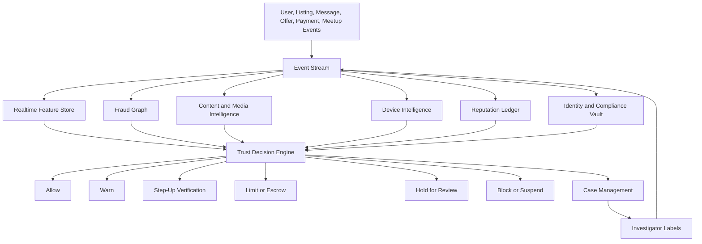

# Advanced Trust and Safety Framework for Consumer Commerce

## Executive objective

The trust and safety system exists to stop scams before a buyer, seller, courier, or community member is exposed to harm. It must treat fraud as an adaptive adversarial system, not a static policy problem. The platform should combine verified identity, graph intelligence, behavioral analytics, device intelligence, listing authenticity, payment protection, safe fulfillment, and human escalation into a unified decisioning layer that continuously evaluates every account, listing, message, offer, payment, meetup, delivery, review, and dispute.

The operating standard is: **no high-risk commerce action should proceed without risk being reduced, contained, transferred, or explicitly accepted under protected terms**.

## 1. Core design principles

1. **Prevention before reimbursement**: The system should block, step-up, escrow, inspect, reroute, or limit risky actions before money, goods, or personal safety are at stake.
2. **Transaction-specific trust**: A user is not simply trusted or untrusted. Risk depends on item category, price, geography, counterparties, device, behavior, payment method, fulfillment path, and current threat intelligence.
3. **Layered defense**: Every critical action is protected by multiple independent controls so fraudsters must defeat identity, device, behavior, graph, content, payment, reputation, and fulfillment defenses simultaneously.
4. **Adaptive adversary assumption**: Fraudsters use synthetic identities, aged accounts, compromised accounts, deepfakes, stolen devices, mule networks, AI-generated messages, realistic receipts, social engineering, and cross-platform coordination.
5. **Explainable intervention**: Users should understand what safety step is required without receiving enough detail to reverse-engineer fraud rules.
6. **Privacy-preserving safety**: Collect the minimum sensitive data required, tokenize or hash it where possible, restrict access, and use purpose-bound retention.
7. **Contestability and correction**: False positives must have appeal paths, evidence review, and score correction without weakening live defenses.
8. **Continuous feedback**: Chargebacks, disputes, shipment failures, law-enforcement reports, user reports, model drift, and investigator labels must update models and rules quickly.
9. **Safe liquidity**: Trust controls should increase successful transactions by matching risk to protections rather than simply rejecting every uncertain user.
10. **Auditable automation**: Every automated decision must preserve features, model version, policy version, explanation code, and reviewer outcome for audit and model improvement.

## 2. Trust architecture overview

The framework is organized around a central **Trust Decision Engine** that receives risk evidence from domain services and returns action-level decisions.

### Decision engine responsibilities

- Score every sensitive action before it is committed.
- Combine deterministic policy, graph rules, machine learning scores, velocity controls, category risk, regulatory requirements, and user protections.
- Choose the least intrusive control that reduces risk below the permitted threshold.
- Return user-safe explanations, internal reason codes, evidence bundles, and model metadata.
- Enforce cooldowns, transaction limits, escrow requirements, meetup restrictions, message redactions, payout holds, and manual-review queues.

### Protected actions

The platform should call the Trust Decision Engine before these actions:

- Account creation, login from a new environment, profile changes, password reset, and payout method changes.
- Identity verification submission, verification reuse, business onboarding, and tax profile updates.
- Listing creation, listing edits, relisting, price changes, category changes, media updates, and promotional boosts.
- Message sending, link sharing, phone or email reveal, attachment upload, off-platform payment language, and meetup scheduling.
- Offer creation, offer acceptance, escrow creation, payment authorization, refund, cancellation, and payout release.
- Review submission, endorsement, social-link connection, group join, referral, and reputation appeal.

## 3. Identity verification

Identity verification should be progressive, risk-triggered, reusable, privacy-preserving, and resistant to synthetic identity fraud.

### Identity trust levels

| Level | Name | Required evidence | Commerce capability |
| --- | --- | --- | --- |
| 0 | Anonymous visitor | Device, IP, coarse region, bot signals | Browse only. |
| 1 | Account basic | Verified email or phone, bot screening, device binding | Save items, low-risk messaging with rate limits. |
| 2 | Commerce ready | Verified phone and payment instrument, risk-screened profile, address confidence | Low-value protected buying or selling. |
| 3 | Verified individual | Government ID, selfie liveness, biometric match, sanctions and fraud-screening result, reusable identity token | Normal marketplace limits, safer profile badge. |
| 4 | High-assurance seller | Level 3 plus proof of address, payout ownership, source-of-goods evidence for risky categories | High-value listings, faster payouts, higher limits. |
| 5 | Verified business | KYB, beneficial ownership, tax registration, business address, merchant account, domain or storefront proof | Business storefronts, bulk inventory, API access. |

### Verification methods

- **Document verification**: Validate government IDs for format, expiration, tampering, MRZ or barcode consistency, image manipulation, and issuing-country rules.
- **Biometric liveness**: Use active and passive liveness to resist replay, masks, screen re-capture, face swaps, and deepfake injection.
- **Synthetic identity checks**: Compare identity age, address history, phone tenure, email tenure, credit-header signals where legally available, payment ownership, and graph connectivity.
- **Payout ownership**: Verify bank or wallet ownership before selling, after payout changes, and before releasing high-risk funds.
- **Proof of possession**: For high-value items, require serial number photos, purchase receipts, original packaging, device activation lock checks, title checks, or app-based ownership transfer.
- **Risk-triggered reverification**: Reverify after SIM swap indicators, new device clusters, payout changes, velocity spikes, account recovery, geolocation anomalies, or suspicious counterparty reports.
- **Privacy-preserving reuse**: Store documents in an encrypted identity vault, expose only verification state and assurance metadata to product systems, and support revocation or expiry.

### Identity defenses against sophisticated fraud

- Detect document-template reuse, face-template reuse, selfie background reuse, and shared metadata across accounts.
- Bind verified identity to device, payout, payment, address, and behavior clusters.
- Prevent unlimited retries by rate-limiting failed identity attempts across device, IP, document hash, biometric template, and payment instrument.
- Require out-of-band recovery and cooling periods for high-risk account recovery or payout changes.
- Maintain a watchlist of confirmed fraud identity artifacts, including hashed document fingerprints, face embeddings where legally permitted, mule payout accounts, and reused address patterns.

## 4. Risk scoring

Risk scoring should be action-specific, calibrated, and tied directly to controls.

### Score taxonomy

| Score | Purpose | Example decision |
| --- | --- | --- |
| `account_risk_score` | Likelihood the account is abusive, compromised, synthetic, or mule-controlled. | Limit messages, require verification, suspend. |
| `listing_risk_score` | Likelihood listing is fraudulent, counterfeit, stolen, duplicated, misleading, or unsafe. | Request evidence, hide listing, send to review. |
| `transaction_risk_score` | Likelihood a specific buyer-seller-item-payment-fulfillment combination will fail or cause harm. | Require escrow, inspection, safe meetup, or block. |
| `payment_risk_score` | Likelihood of chargeback, stolen payment, refund abuse, account takeover, or mule payout. | 3DS, payment hold, payout delay, alternate method. |
| `message_risk_score` | Likelihood the conversation contains scam, coercion, grooming, harassment, or off-platform steering. | Redact content, warn, restrict contact sharing. |
| `meetup_risk_score` | Likelihood a physical handoff creates safety risk. | Require public zone, daylight window, code exchange, or courier. |
| `reputation_confidence_score` | Reliability of reputation signals and risk of gaming. | Downweight reviews, require verified transaction reviews. |

### Feature classes

- Account age, verification level, identity confidence, recovery events, profile completeness, and account-change history.
- Device lineage, emulator or automation signals, IP quality, proxy or VPN pattern, ASN risk, geolocation consistency, and impossible travel.
- Listing media originality, text similarity, category risk, price anomaly, serial or receipt validation, edit velocity, and inventory consistency.
- Conversation intent, pressure tactics, external links, contact disclosure, payment steering, urgency, threats, and language-model-generated scam signatures.
- Payment instrument age, ownership match, card BIN risk, authorization behavior, chargeback history, payout mismatch, and refund velocity.
- Graph proximity to banned accounts, known mule accounts, suspicious devices, disputed transactions, duplicate listings, and shared artifacts.
- Counterparty asymmetry, such as a new seller with a high-value item messaging a new buyer from a risky device.
- Fulfillment risk, including unsafe locations, late-night meetings, address mismatch, courier anomalies, and code-exchange failures.

### Decision bands

| Band | Risk range | Default action |
| --- | --- | --- |
| Green | Very low | Allow with standard protections and passive monitoring. |
| Yellow | Low to moderate | Allow with contextual warnings, escrow recommendation, or mild rate limits. |
| Orange | Elevated | Require step-up verification, protected payment, evidence upload, or safe fulfillment. |
| Red | High | Hold for review, hide listing, delay payout, or block sensitive action. |
| Black | Confirmed abuse | Suspend, claw back eligible funds, preserve evidence, and protect impacted users. |

## 5. Reputation scoring

Reputation should measure demonstrated reliability, not popularity. It must resist gaming, retaliatory reviews, paid review rings, and collusive transaction loops.

### Reputation dimensions

- **Transaction completion**: Successful completion rate adjusted for category difficulty and user tenure.
- **Accuracy**: Match between listing claims, media, inspection, buyer confirmation, and dispute outcomes.
- **Payment reliability**: Authorization success, chargeback rate, refund abuse, and payout stability.
- **Fulfillment reliability**: On-time pickup, shipping scans, locker completion, courier handoff, and cancellation rate.
- **Communication quality**: Responsiveness, clarity, policy compliance, and absence of coercive language.
- **Dispute conduct**: Evidence quality, resolution compliance, repeat dispute patterns, and mediation outcomes.
- **Community standing**: Verified group participation, trusted referrals, local endorsements, and moderator outcomes.
- **Category expertise**: Performance by category, such as electronics, vehicles, collectibles, tickets, luxury goods, services, and rentals.

### Anti-gaming controls

- Count only verified transaction reviews in primary reputation.
- Weight reviews by reviewer trust, transaction value, category risk, time decay, and fraud confidence.
- Suppress reputation gains from circular trading, shared devices, shared payment instruments, shared addresses, dense reciprocal clusters, and repeated tiny transactions.
- Detect review extortion, retaliation, suspicious timing, repeated language templates, and AI-generated fake praise.
- Separate **score** from **confidence** so new or thin-file users can be treated cautiously without being unfairly labeled bad.
- Preserve negative safety-critical events longer than ordinary rating signals, subject to law and appeal outcomes.

### User-facing reputation

Users should see understandable trust summaries:

- Verified identity level and whether verification is current.
- Number of completed protected transactions by role and category.
- On-time fulfillment rate, cancellation rate, and dispute rate.
- Recent safety warnings, if visible under policy.
- Reputation confidence, such as new, developing, established, or high-confidence.
- Transaction-specific safety recommendation, such as “use escrow and locker pickup for this item.”

## 6. Behavioral analysis

Behavioral analysis should detect intent and account state changes before a scam completes.

### Behavioral baselines

The system should build user, cohort, category, city, and device-cluster baselines for:

- Login time, location, device, typing rhythm, navigation path, and session length.
- Listing creation pace, category mix, photo style, description style, price distribution, and edit behavior.
- Message timing, linguistic patterns, link-sharing behavior, negotiation style, and pressure tactics.
- Offer velocity, cancellation pattern, refund requests, dispute triggers, and payout timing.
- Meetup preferences, repeated location changes, no-show behavior, and code-exchange anomalies.

### High-risk behavior patterns

- New or dormant account suddenly lists many high-value goods.
- Account changes payout destination shortly before a large payout.
- Seller pushes urgent off-platform payment or shipping outside protected flows.
- Buyer sends overpayment, fake escrow, fake courier, or refund-pressure scripts.
- User repeatedly asks for phone numbers, email addresses, gift cards, crypto, wire transfer, or screenshots of codes.
- Account switches writing style, language, region, device, and transaction pattern in a short window.
- Multiple accounts coordinate to create false demand, manipulate price, or build reputation.
- Fraudster uses AI-generated empathy, urgency, authority, or scarcity scripts across many conversations.

### Behavioral interventions

- Invisible friction: rate limits, delayed exposure, search demotion, invite cooldowns, and payout holds.
- Visible friction: warnings, educational prompts, confirmation screens, protected-payment nudges, and scam-check questions.
- Step-up: liveness check, payment re-authentication, payout reverification, proof of ownership, or manual review.
- Containment: disable link sharing, mask contact info, force in-app payment, restrict meetup location, or require locker handoff.
- Hard stop: block message, hide listing, freeze funds, or suspend account.

## 7. Device fingerprinting

Device intelligence should identify coordinated abuse while respecting privacy and legal constraints.

### Signal categories

- Stable device characteristics: device model, OS version, browser family, app version, hardware-backed attestation, jailbreak or root state, emulator signals, and automation frameworks.
- Network context: IP reputation, ASN, proxy or VPN patterns, TOR exit nodes, hosting-provider traffic, geolocation confidence, and impossible travel.
- App integrity: certificate integrity, tampering, instrumentation, debugging, replayed API calls, and bot-like interaction speed.
- Identifier graph: salted device fingerprint hash, push token history, cookie lineage, install ID, session ID, and risk-cluster membership.
- Privacy controls: rotate salts by purpose and region, avoid exposing raw fingerprints to non-safety systems, and provide policy disclosures.

### Device graph use cases

- Link new accounts to banned accounts without relying on a single brittle identifier.
- Detect device farms, emulator fleets, bot signup runs, and account-aging operations.
- Identify account takeover when a trusted user suddenly acts from a new risky cluster.
- Raise friction when many users, payment instruments, listings, or disputes converge on the same device cluster.
- Prevent evasion by combining weak signals instead of depending on one fingerprinting method.

## 8. Scam detection

Scam detection should operate across listings, messages, payments, identity, support interactions, and off-platform signals reported by users.

### Scam typology

| Scam type | Early signals | Preventive control |
| --- | --- | --- |
| Off-platform payment | Gift cards, crypto, wire, external escrow, fake payment screenshots, contact harvesting. | Block or redact message, warn counterparty, require in-app payment. |
| Fake shipping or courier | External label, fake courier domain, overpayment, pickup-code request. | Domain intelligence, protected labels, code masking, transaction lock. |
| Counterfeit or stolen goods | Price too low, reused photos, missing serial, high-risk brand, inconsistent receipt. | Proof of ownership, serial validation, inspection, listing hold. |
| Rental deposit fraud | Urgency, unavailable viewing, copied photos, mismatched address, upfront deposit. | Address proof, viewing verification, escrow deposit, duplicate web-image detection. |
| Vehicle title fraud | VIN mismatch, title delay, lien ambiguity, odometer inconsistency. | VIN check, title verification, escrow, DMV-aware workflow. |
| Ticket fraud | Transfer delay, screenshot ticket, duplicated barcode, event proximity. | Integrated ticket transfer, barcode invalidation, escrow release after scan. |
| Account takeover | New device, changed payout, changed language, unusual listing or message pattern. | Step-up auth, payout cooling period, session revocation. |
| Refund or chargeback abuse | Repeated item-not-received claims, address anomalies, return mismatch. | Signature proof, inspection, refund limits, evidence scoring. |
| Romance or social engineering | Non-commerce intimacy, emergency claims, financial requests. | Conversation safety model, delayed send, reporting prompts. |
| Mule recruiting | Job offer language, package forwarding, bank-account use. | Message block, education warning, account review. |

### Content intelligence

- Use multimodal models to analyze text, images, videos, receipts, labels, serial numbers, QR codes, screenshots, and embedded URLs.
- Maintain scam-script embeddings to detect paraphrased versions of known scams, including AI-generated variants.
- Use domain reputation and URL expansion to detect phishing, fake escrow, fake courier, malware, and impersonation sites.
- Detect attempts to evade moderation through obfuscation, images of text, homoglyphs, spacing, foreign-language variants, and coded phrases.
- Evaluate complete conversation trajectory, not just individual messages.

## 9. Duplicate listing detection

Duplicate detection should prevent copied listings, relisting evasion, inventory spam, stolen-photo scams, and cross-account manipulation.

### Matching signals

- Perceptual image hashes, image embeddings, video-frame embeddings, EXIF anomalies, screenshot detection, and web-image matches.
- Text embeddings, title similarity, structured attribute similarity, serial number matches, SKU matches, and receipt similarity.
- Price, category, location, timing, seller graph, fulfillment method, and contact-pattern similarity.
- Device, IP, payout, payment, address, and social graph overlap.
- Historical removals, disputes, chargebacks, and duplicate-review outcomes.

### Duplicate classes

| Class | Description | Action |
| --- | --- | --- |
| Legitimate multi-channel inventory | Same business posts controlled inventory across locations or channels. | Merge inventory, suppress duplicates, preserve seller controls. |
| Accidental duplicate | Same user relists or edits incorrectly. | Suggest merge, preserve best listing, avoid penalty. |
| Spam duplicate | User floods category with near-identical listings. | Rate-limit, downrank, require inventory proof. |
| Stolen-content duplicate | Different user copies another listing or web image. | Hold listing, require original media or ownership proof. |
| Fraud ring duplicate | Many accounts rotate the same high-risk listing. | Block cluster, preserve evidence, notify exposed users. |

### Pre-publication controls

- Run duplicate detection before listing publication and before major listing edits.
- Require fresh camera capture or guided video for high-value goods with duplicate signals.
- Watermark platform-generated media internally for provenance while avoiding user-visible leakage.
- Prevent banned listings from reappearing through small text, image crop, or price changes.

## 10. Social trust signals

Social trust can improve trust only when it is verified, consented, and protected from manipulation.

### Signal sources

- Verified transaction history with known users.
- Mutual groups, campus, workplace, neighborhood, professional association, or alumni verification.
- Trusted referrals from high-confidence users.
- Verified business domain, storefront, tax profile, and external merchant presence.
- Social profile tenure and consistency where users opt in.
- Community moderation outcomes and local group standing.

### Safeguards

- Never make sensitive social connections public by default.
- Weight social trust by source integrity, recency, relationship strength, and fraud resistance.
- Detect referral farms, endorsement rings, reciprocal endorsement bursts, and compromised social accounts.
- Avoid giving fraudsters full graph visibility; expose simple user-facing badges and contextual assurances.
- Use social trust as a positive confidence signal, not a substitute for identity, payment, or transaction protection.

## 11. Safe meetup systems

Safe meetup systems should reduce physical risk and prevent payment or item handoff ambiguity.

### Safe handoff options

1. **Verified public meetup zones**: Police stations, city buildings, libraries, retail partners, campuses, or monitored lots.
2. **Smart lockers**: Code-based item deposit, pickup proof, weight or image verification, escrow-linked release, and dispute evidence.
3. **Partner pickup counters**: Staffed handoff points with identity check and item scan.
4. **Courier handoff**: Vetted courier pickup and delivery for high-value or unsafe-meetup transactions.
5. **Inspection centers**: Optional authentication, condition checks, serial validation, and packaging.
6. **In-app remote completion**: Shipping or digital transfer flows where meetup is unnecessary.

### Meetup risk controls

- Recommend or require safer fulfillment based on meetup risk, item value, user trust, time, location, and counterparty history.
- Hide exact user address until required and support approximate-location negotiation.
- Block or warn on unsafe times, repeated location changes, private residences for high-risk transactions, and known incident zones.
- Use in-app check-in, temporary location sharing, emergency contact sharing, panic actions, and no-show reporting.
- Use rotating pickup codes, QR confirmation, item photos at handoff, and escrow release rules tied to proof.
- Keep all scheduling and payment inside the platform; discourage cash for high-risk transactions.

### Physical safety playbooks

- For low-risk items, recommend daylight public meetup and protected payment.
- For high-value electronics, require serial proof, protected payment, and locker or partner counter.
- For vehicles, require VIN checks, title workflow, daylight public inspection, and escrow.
- For luxury goods, require authentication or inspection before payout.
- For services, use milestone escrow, verified profiles, arrival check-ins, and post-service confirmation.

## 12. Fraud prevention AI

Fraud prevention AI should combine predictive models, graph intelligence, rules, simulation, investigator tooling, and generative-AI defenses.

### Model portfolio

- **Account risk model**: Detect abusive signups, synthetic identities, account farms, and compromised accounts.
- **Listing authenticity model**: Detect fake, stolen, counterfeit, prohibited, duplicated, or misleading listings.
- **Conversation scam model**: Detect social engineering, off-platform steering, harassment, mule recruiting, and payment scams.
- **Transaction risk model**: Predict failed or fraudulent transactions using buyer, seller, item, payment, fulfillment, and message features.
- **Payment fraud model**: Predict stolen instruments, chargebacks, refund abuse, payout fraud, and mule networks.
- **Graph neural risk model**: Score entities and clusters across users, devices, payments, listings, addresses, identities, and disputes.
- **Anomaly detection model**: Surface unknown patterns, zero-day scam formats, sudden category attacks, and regional fraud spikes.
- **Policy LLM**: Assist investigators, summarize evidence, classify policy issues, draft safe user explanations, and detect semantic evasion.

### Adversarial resilience

- Train on confirmed fraud, near misses, investigator labels, chargebacks, disputes, and synthetic adversarial examples.
- Red-team models with prompt injection, scam-script paraphrases, image manipulation, face swaps, receipt fabrication, URL obfuscation, and collusive graph attacks.
- Use model ensembles so attackers cannot optimize against a single score.
- Monitor population stability, feature drift, false-positive rates, attack concentration, and intervention effectiveness by segment.
- Keep high-impact decisions behind policy orchestration and human-review thresholds, not unconstrained model output.
- Version every model, feature set, threshold, and policy rule for reproducibility.

### AI safety guardrails

- Do not expose raw risk scores or exact model triggers to users.
- Separate user-facing explanations from internal fraud labels.
- Require human review for permanent high-impact actions unless confirmed abuse evidence is strong and policy-approved.
- Prevent investigator overreliance by showing calibrated uncertainty and counter-evidence.
- Use privacy-preserving model development, access controls, and retention limits for sensitive identity and biometric data.

## 13. Proactive scam-stopping journeys

### High-value electronics listing

1. Seller creates listing for a high-value phone or laptop.
2. Listing authenticity model checks media originality, serial format, price anomaly, prior duplicates, and seller risk.
3. If risk is elevated, the system requires fresh guided video, serial capture, proof of ownership, and activation-lock status.
4. Listing stays unpublished until checks pass or an investigator clears it.
5. Buyer sees verification status, protected payment requirement, and safe locker or partner-counter fulfillment.
6. Escrow releases only after pickup proof and buyer condition confirmation window.

### Off-platform payment attempt

1. Conversation model detects gift-card, crypto, wire, external escrow, or phone-number pressure.
2. Message is blocked or redacted before delivery if confidence is high.
3. Recipient receives a tailored scam warning without exposing detection internals.
4. Sender receives policy guidance or account restriction depending on history.
5. Account, listing, and transaction risk scores update immediately.
6. Related users, devices, and listings are rescored through the fraud graph.

### Account takeover before payout theft

1. Trusted seller logs in from a new high-risk device and changes payout account.
2. Device and behavior models detect impossible travel, writing-style shift, and payout mismatch.
3. Payout change enters a cooling period; existing sessions are challenged.
4. Seller must pass liveness and out-of-band recovery through a previously trusted factor.
5. Pending payouts are held until identity confidence is restored.
6. If takeover is confirmed, affected conversations and listings are frozen and counterparties are warned.

### Duplicate rental scam

1. User posts a rental with copied photos, unusually low price, and pressure for deposit.
2. Duplicate detection finds web-image and cross-platform matches.
3. Address validation shows mismatch or lack of property control.
4. Listing is held before publication and user must provide property verification.
5. Any exposed users receive warnings and deposit actions are blocked.

## 14. Case management and human operations

Automation should triage and contain risk, while expert human operations handle ambiguous and high-impact cases.

### Case queues

- Identity verification exceptions.
- High-value listing authenticity review.
- Payment and chargeback investigation.
- Account takeover recovery.
- Physical safety incidents.
- Organized fraud ring investigation.
- User appeal and score correction.
- Law-enforcement and legal preservation workflows.

### Investigator tooling

- Unified entity graph with users, devices, listings, payments, addresses, identities, conversations, disputes, and prior actions.
- Timeline reconstruction for account, listing, conversation, payment, and fulfillment events.
- Evidence bundles with model explanations, content highlights, duplicate matches, and graph paths.
- One-click protective actions: hide listing, block message, freeze payout, require verification, warn users, or suspend cluster.
- Collaboration tools, quality review, escalation notes, and audit logs.
- LLM-assisted summaries constrained to cite evidence and never invent facts.

## 15. Metrics and governance

### North-star safety metrics

- Scam loss prevented before payment.
- Scam exposure rate per thousand conversations or transactions.
- Confirmed fraud rate by GMV, category, region, and channel.
- High-risk action intervention precision and recall.
- Time from first fraudulent signal to containment.
- Chargeback rate, dispute rate, and payout-loss rate.
- Physical safety incident rate per meetup.
- Duplicate fraudulent listing publication rate.
- Account takeover loss rate and recovery time.
- False-positive appeal overturn rate and time to resolution.

### Governance routines

- Daily fraud attack review by category and region.
- Weekly model drift and intervention effectiveness review.
- Monthly threshold calibration with product, legal, compliance, privacy, and operations.
- Quarterly adversarial red-team exercises against identity, device, graph, listing, payment, and conversation defenses.
- Post-incident reviews for major scams, model failures, physical safety incidents, or policy gaps.

## 16. Data model additions

The framework requires event-sourced trust data with strong auditability.

| Table or store | Purpose |
| --- | --- |
| `trust_decisions` | Immutable record of every allow, warn, step-up, hold, block, or suspend decision. |
| `risk_features_online` | Low-latency feature store for current action scoring. |
| `risk_feature_snapshots` | Point-in-time feature values used for model reproducibility. |
| `fraud_entities` | Canonical graph nodes for users, devices, payments, listings, addresses, identities, documents, phones, emails, and URLs. |
| `fraud_edges` | Versioned graph relationships with evidence, confidence, and first-seen or last-seen timestamps. |
| `identity_assurance_events` | Verification, liveness, reverification, expiry, and failure events. |
| `device_risk_events` | Device fingerprint, attestation, automation, network, and cluster events. |
| `listing_integrity_events` | Duplicate, authenticity, ownership, prohibited-item, and media-forensics events. |
| `conversation_safety_events` | Scam, harassment, off-platform, coercion, link, and contact-sharing detections. |
| `meetup_safety_events` | Location, schedule, check-in, code exchange, no-show, panic, and incident events. |
| `model_decision_metadata` | Model version, policy version, thresholds, reason codes, and calibration data. |
| `fraud_cases` | Human review queue, labels, outcomes, appeal links, and evidence references. |

## 17. Implementation roadmap

### Phase 1: Safety foundation

- Add Trust Decision Engine for account, listing, message, offer, payment, and payout actions.
- Implement protected payment defaults, basic identity levels, device binding, message scam rules, duplicate image checks, and case management.
- Launch verified transaction reviews and reputation confidence.

### Phase 2: Realtime prevention

- Add online feature store, fraud graph, behavioral baselines, category-specific risk models, and pre-publication listing integrity checks.
- Add safe meetup recommendations, escrow risk rules, payout cooling periods, and counterparty warnings.
- Add investigator graph tooling and feedback labels.

### Phase 3: Advanced AI and graph defense

- Deploy multimodal listing authenticity models, conversation trajectory models, graph neural fraud scoring, adversarial scam embeddings, and AI-assisted investigation.
- Add proof-of-ownership workflows for high-risk categories and integrated authenticity partners.
- Introduce adaptive thresholds by category, region, liquidity, and attack pressure.

### Phase 4: Autonomous prevention network

- Run continuous fraud simulations, automated cluster containment, real-time threat intelligence sharing, and red-team-driven model hardening.
- Use AI agents to negotiate safer fulfillment and payment terms automatically within user-approved boundaries.
- Expose trust APIs for partners while keeping sensitive risk intelligence protected.

## 18. Success state

The end state is a marketplace where fraudsters are forced into narrow, expensive, low-yield attack paths. Suspicious listings are challenged before publication. Scam messages are blocked before recipients see them. Risky payments are contained before funds move. Unsafe meetups are rerouted before people meet. Reputation cannot be bought cheaply. Identity cannot be recycled easily. Device farms and mule networks become visible as graphs. Human investigators focus on ambiguous, high-impact cases instead of repetitive abuse.

The platform wins when legitimate users experience more confidence and less friction over time, while sophisticated fraudsters experience compounding cost, lower reach, lower payout probability, and faster containment.
